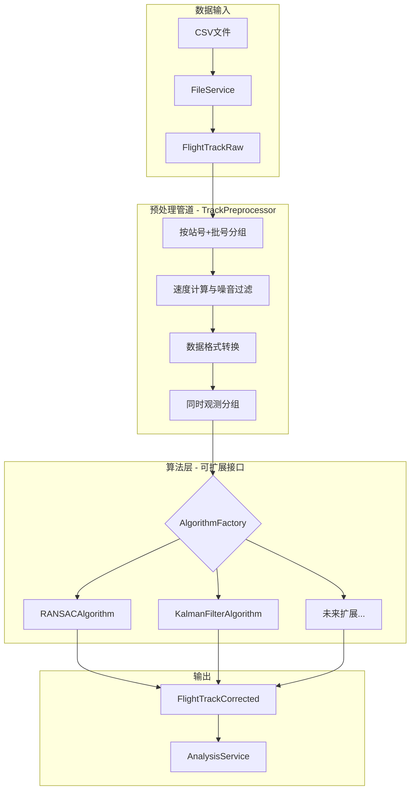
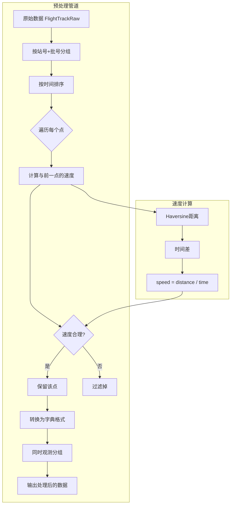
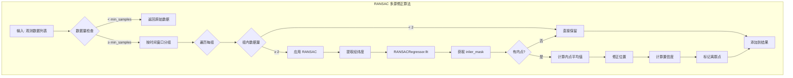
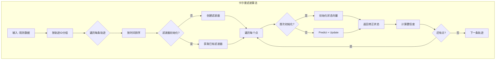
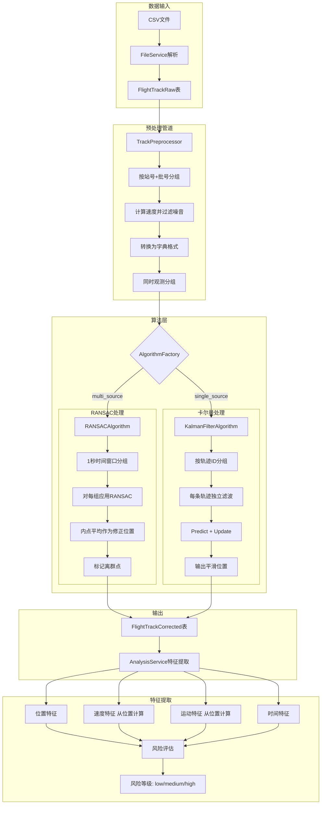
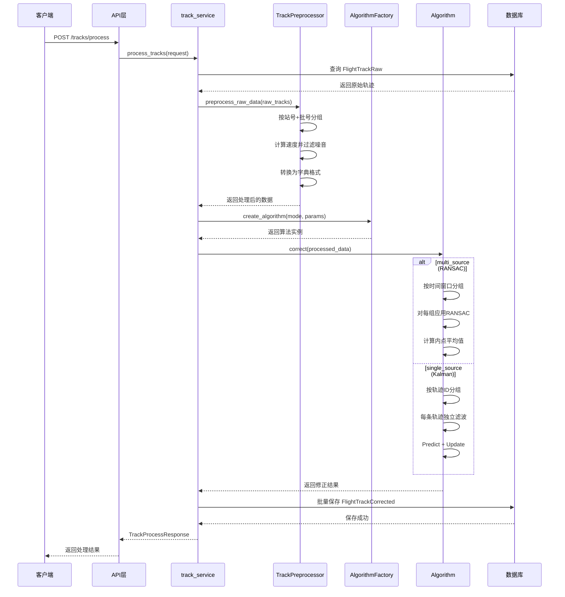

# 轨迹处理模块算法实现详细分析文档

> 生成时间: 2026-02-19
> 作者: RFTIP 系统
> 版本: 2.0 (重构版)
>
> **更新说明**: 本文档已更新以反映基于 MRRA 雷达误差分析方法的新架构，包括：
> - 从位置数据计算速度/航向（不使用原始列）
> - 1秒时间窗口匹配同时观测
> - 0.12度位置阈值
> - 可扩展的算法接口设计

---

## 目录

1. [架构概述](#1-架构概述)
2. [文件位置索引](#2-文件位置索引)
3. [数据模型结构](#3-数据模型结构)
4. [预处理管道](#4-预处理管道)
5. [可扩展算法接口](#5-可扩展算法接口)
6. [RANSAC 多源修正算法](#6-ransac-多源修正算法)
7. [卡尔曼滤波单源修正算法](#7-卡尔曼滤波单源修正算法)
8. [轨迹特征提取与分析](#8-轨迹特征提取与分析)
9. [完整算法流程图](#9-完整算法流程图)
10. [性能分析与优化](#10-性能分析与优化)

---

## 1. 架构概述

### 1.1 设计原则

新架构基于以下核心原则：

1. **不依赖原始速度/航向列**: 通过经纬度位置数据计算速度和航向
2. **基于数据的参数选择**: 时间窗口(1秒)和位置阈值(0.12度)基于真实数据分析
3. **可扩展的算法接口**: 使用抽象工厂模式，便于添加新算法
4. **模块化预处理管道**: 噪音过滤、时间分组、空间匹配分离

### 1.2 系统架构图



### 1.3 核心配置参数

**位置**: `app/services/track_service.py:30-48`

```python
class PreprocessingConfig:
    """预处理配置（基于参考文档和数据分析）"""

    # 时间窗口（秒）
    TIME_WINDOW_MATCH = 1.0  # 同时观测时间窗口
    TIME_WINDOW_EXTRACTION = 60  # 关键航迹提取时间窗口

    # 空间参数（度）
    GRID_RESOLUTION = 0.2  # 空间网格分辨率（约22km）
    POSITION_THRESHOLD = 0.12  # 位置匹配阈值（约13.3km）

    # 轨迹质量参数
    MIN_DURATION = 45  # 最短持续时间（秒）
    MIN_POINTS = 10  # 最小航迹点数
    MAX_TIME_GAP = 100  # 最大时间间隔（秒）

    # 速度阈值（用于噪音过滤，从位置计算）
    MAX_SPEED_KMH = 800  # 最大合理速度
    MIN_SPEED_KMH = 50   # 最小合理速度
```

---

## 2. 文件位置索引

### 2.1 路由层 (API 接口)

| 文件路径 | 功能说明 | 主要 API |
|----------|----------|----------|
| `app/routers/tracks.py` | 轨迹处理路由 | POST /tracks/process, GET /tracks/raw, GET /tracks/corrected |
| `app/routers/analysis.py` | 轨迹分析路由 | POST /analysis/trajectory, POST /analysis/segment |
| `app/routers/query.py` | 数据查询路由 | GET /query/statistics, GET /query/radar-stations |

### 2.2 服务层 (算法实现)

| 文件路径 | 功能说明 | 核心类/函数 |
|----------|----------|------------|
| `app/services/track_service.py` | 轨迹处理核心算法 | `TrackCorrectionAlgorithm`, `RANSACAlgorithm`, `KalmanFilterAlgorithm`, `AlgorithmFactory`, `TrackPreprocessor` |
| `app/services/analysis_service.py` | 轨迹分析算法 | `TrajectoryFeatureExtractor`, `analyze_trajectory()`, `assess_risk_level()` |
| `app/services/file_service.py` | 文件上传与解析 | `COLUMN_NAME_MAPPING`, `parse_timestamp()` |

### 2.3 数据模型层

| 文件路径 | 功能说明 | 核心模型 |
|----------|----------|----------|
| `app/models/flight_track.py` | 轨迹数据模型 | `FlightTrackRaw`, `FlightTrackCorrected`, `RadarStation` |
| `app/schemas/track.py` | Pydantic 验证模型 | `TrackProcessRequest`, `RawTrackResponse`, `CorrectedTrackResponse` |

---

## 3. 数据模型结构

### 3.1 原始轨迹表 (FlightTrackRaw)

**位置**: `app/models/flight_track.py:32-59`

```python
class FlightTrackRaw(Base):
    __tablename__ = "flight_tracks_raw"

    # 主键与关联
    id: int                           # 轨迹ID (主键)
    file_id: int                      # 数据文件ID (外键)
    track_id: str                     # 轨迹编号（批号）

    # 时间与位置
    timestamp: DateTime               # 时间戳（入库时间）
    latitude: float                   # 纬度
    longitude: float                  # 经度
    altitude: float                   # 高度（米）

    # 运动参数（仅存储，不用于算法）
    speed: float                      # 原始速度（不使用）
    heading: float                    # 原始航向（不使用）

    # 雷达相关
    radar_station_id: int             # 雷达站ID (站号)
    target_id: str                    # 目标编号
    radar_cross_section: float        # 雷达截面积
    signal_quality: float             # 信号质量

    # 其他
    measurement_id: str               # 测量ID
    raw_data: str                     # 原始数据（JSON）
```

### 3.2 修正轨迹表 (FlightTrackCorrected)

**位置**: `app/models/flight_track.py:62-85`

```python
class FlightTrackCorrected(Base):
    __tablename__ = "flight_tracks_corrected"

    # 关联
    id: int                           # 修正轨迹ID (主键)
    raw_track_id: int                 # 原始轨迹ID (外键)
    track_id: str                     # 轨迹编号

    # 修正后位置
    timestamp: DateTime               # 时间戳
    latitude: float                   # 修正后纬度
    longitude: float                  # 修正后经度
    altitude: float                   # 修正后高度（米）

    # 算法输出
    correction_method: str            # 修正方法 (ransac/kalman)
    confidence_score: float           # 置信度分数 (0-1)
    is_outlier: int                   # 是否为离群值 (0:否, 1:是)
    correction_metadata: str          # 修正元数据（JSON）
```

---

## 4. 预处理管道

### 4.1 预处理配置

**位置**: `app/services/track_service.py:30-48`

预处理配置基于对真实数据的分析：

| 参数 | 值 | 来源说明 |
|------|-----|----------|
| `TIME_WINDOW_MATCH` | 1.0秒 | 真实数据95%分位数为1.000秒 |
| `POSITION_THRESHOLD` | 0.12度 | 约13.3km，参考文档推荐值 |
| `MAX_SPEED_KMH` | 800 km/h | 民航飞机最大速度限制 |
| `MIN_SPEED_KMH` | 50 km/h | 最小飞行速度 |

### 4.2 速度与航向计算

**位置**: `app/services/track_service.py:83-111`

**重要**: 系统不使用原始数据的 `speed` 和 `heading` 列，而是从位置数据计算。

```python
def calculate_velocity(
    point1: Dict,
    point2: Dict
) -> Tuple[float, float, float]:
    """
    从位置数据计算速度和航向

    Returns:
        (速度_mps, 速度_kmh, 航向度)
    """
    # 步骤1: 计算 Haversine 距离
    distance = haversine_distance(
        point1['latitude'], point1['longitude'],
        point2['latitude'], point2['longitude']
    )

    # 步骤2: 计算时间差
    time_diff = (point2['timestamp'] - point1['timestamp']).total_seconds()

    if time_diff == 0:
        return 0, 0, 0

    # 步骤3: 计算速度
    speed_mps = distance / time_diff
    speed_kmh = speed_mps * 3.6

    # 步骤4: 计算航向（方位角）
    heading = calculate_bearing(
        point1['latitude'], point1['longitude'],
        point2['latitude'], point2['longitude']
    )

    return speed_mps, speed_kmh, heading
```

### 4.3 Haversine 距离计算

**位置**: `app/services/track_service.py:55-66`

```python
def haversine_distance(lat1: float, lon1: float, lat2: float, lon2: float) -> float:
    """计算两点之间的球面距离（米）"""
    R = 6371000  # 地球半径（米）
    lat1_rad, lat2_rad = math.radians(lat1), math.radians(lat2)
    dlat = math.radians(lat2 - lat1)
    dlon = math.radians(lon2 - lon1)

    a = (math.sin(dlat / 2) ** 2 +
         math.cos(lat1_rad) * math.cos(lat2_rad) *
         math.sin(dlon / 2) ** 2)

    return R * 2 * math.asin(math.sqrt(a))
```

### 4.4 方位角计算

**位置**: `app/services/track_service.py:69-80`

```python
def calculate_bearing(lat1: float, lon1: float, lat2: float, lon2: float) -> float:
    """计算从点1到点2的方位角（度）"""
    lat1_rad = math.radians(lat1)
    lat2_rad = math.radians(lat2)
    dlon = math.radians(lon2 - lon1)

    y = math.sin(dlon) * math.cos(lat2_rad)
    x = (math.cos(lat1_rad) * math.sin(lat2_rad) -
         math.sin(lat1_rad) * math.cos(lat2_rad) * math.cos(dlon))

    bearing = math.atan2(y, x)
    return (math.degrees(bearing) + 360) % 360
```

### 4.5 TrackPreprocessor 预处理类

**位置**: `app/services/track_service.py:523-651`

```python
class TrackPreprocessor:
    """轨迹预处理管道"""

    def __init__(self, config: PreprocessingConfig = None):
        self.config = config or PreprocessingConfig()

    def preprocess_raw_data(
        self,
        raw_tracks: List[FlightTrackRaw]
    ) -> List[Dict]:
        """
        预处理原始轨迹数据

        步骤：
        1. 按站号+批号分组
        2. 速度过滤（使用从位置计算的速度）
        3. 数据转换为字典格式
        """
        # 按站号+批号分组
        from collections import defaultdict
        groups = defaultdict(list)

        for track in raw_tracks:
            key = f"{track.radar_station_id}_{track.track_id}"
            groups[key].append(track)

        processed_data = []

        for group_key, tracks in groups.items():
            # 按时间排序
            tracks = sorted(tracks, key=lambda t: t.timestamp)

            # 速度过滤
            valid_indices = [0]  # 第一个点总是保留

            for i in range(1, len(tracks)):
                # 计算与前一个点的速度（从位置计算）
                point1 = {
                    'latitude': tracks[i-1].latitude,
                    'longitude': tracks[i-1].longitude,
                    'timestamp': tracks[i-1].timestamp,
                }
                point2 = {
                    'latitude': tracks[i].latitude,
                    'longitude': tracks[i].longitude,
                    'timestamp': tracks[i].timestamp,
                }

                _, speed_kmh, _ = calculate_velocity(point1, point2)

                # 检查速度是否合理
                if self.config.MIN_SPEED_KMH <= speed_kmh <= self.config.MAX_SPEED_KMH:
                    valid_indices.append(i)

            # 转换为字典格式
            for idx in valid_indices:
                track = tracks[idx]
                processed_data.append({
                    'raw_track_id': track.id,
                    'track_id': track.track_id,
                    'timestamp': track.timestamp,
                    'latitude': track.latitude,
                    'longitude': track.longitude,
                    'altitude': track.altitude or 0,
                    'radar_station_id': track.radar_station_id,
                    'raw_data': json.loads(track.raw_data) if track.raw_data else {},
                })

        return processed_data
```

### 4.6 同时观测分组

**位置**: `app/services/track_service.py:592-651`

```python
def group_simultaneous_observations(
    self,
    observations: List[Dict]
) -> List[List[Dict]]:
    """
    分组同时观测

    条件：
    1. 时间差 <= TIME_WINDOW_MATCH (1秒)
    2. 位置差 <= POSITION_THRESHOLD (0.12度)
    3. 不同雷达站
    """
    # 按时间排序
    sorted_obs = sorted(observations, key=lambda o: o['timestamp'])

    groups = []
    processed = set()

    for i, obs_a in enumerate(sorted_obs):
        if id(obs_a) in processed:
            continue

        current_group = [obs_a]
        processed.add(id(obs_a))

        # 寻找匹配的观测
        for j, obs_b in enumerate(sorted_obs):
            if i == j or id(obs_b) in processed:
                continue

            # 不同雷达站
            if obs_a['radar_station_id'] == obs_b['radar_station_id']:
                continue

            # 检查时间差 (<= 1秒)
            time_diff = abs((obs_b['timestamp'] - obs_a['timestamp']).total_seconds())
            if time_diff > self.config.TIME_WINDOW_MATCH:
                continue

            # 检查位置距离 (<= 0.12度)
            distance = haversine_distance(
                obs_a['latitude'], obs_a['longitude'],
                obs_b['latitude'], obs_b['longitude']
            )
            distance_deg = distance / 111000  # 转换为度

            if distance_deg > self.config.POSITION_THRESHOLD:
                continue

            # 匹配成功
            current_group.append(obs_b)
            processed.add(id(obs_b))

        if len(current_group) >= 2:
            groups.append(current_group)

    return groups
```

### 4.7 预处理流程图



---

## 5. 可扩展算法接口

### 5.1 TrackCorrectionAlgorithm 抽象基类

**位置**: `app/services/track_service.py:118-159`

```python
class TrackCorrectionAlgorithm(ABC):
    """轨迹修正算法接口"""

    @abstractmethod
    def get_name(self) -> str:
        """获取算法名称"""
        pass

    @abstractmethod
    def get_parameters(self) -> Dict:
        """获取算法参数"""
        pass

    @abstractmethod
    def set_parameters(self, params: Dict):
        """设置算法参数"""
        pass

    @abstractmethod
    def correct(
        self,
        observations: List[Dict]
    ) -> Dict:
        """
        执行修正算法

        Args:
            observations: 观测数据列表，每个包含:
                - latitude, longitude, altitude
                - timestamp (datetime)
                - radar_station_id
                - track_id
                - raw_data (原始数据)

        Returns:
            修正结果，包含:
                - corrected_observations: 修正后的观测列表
                - confidence_scores: 置信度列表
                - outlier_flags: 离群点标记列表
                - metadata: 算法元数据
        """
        pass
```

### 5.2 AlgorithmFactory 算法工厂

**位置**: `app/services/track_service.py:487-516`

```python
class AlgorithmFactory:
    """算法工厂，用于创建和获取算法实例"""

    _algorithms = {
        'ransac': RANSACAlgorithm,
        'kalman': KalmanFilterAlgorithm,
    }

    @classmethod
    def create_algorithm(
        cls,
        algorithm_name: str,
        **params
    ) -> TrackCorrectionAlgorithm:
        """创建算法实例"""
        if algorithm_name.lower() not in cls._algorithms:
            raise ValueError(f"不支持的算法: {algorithm_name}")

        algorithm_class = cls._algorithms[algorithm_name.lower()]
        return algorithm_class(**params)

    @classmethod
    def register_algorithm(cls, name: str, algorithm_class: type):
        """注册新算法（用于扩展）"""
        cls._algorithms[name.lower()] = algorithm_class

    @classmethod
    def list_algorithms(cls) -> List[str]:
        """列出所有可用算法"""
        return list(cls._algorithms.keys())
```

### 5.3 如何扩展新算法

**示例：添加粒子滤波算法**

```python
# 1. 实现算法接口
class ParticleFilterAlgorithm(TrackCorrectionAlgorithm):
    """粒子滤波算法"""

    def __init__(self, num_particles: int = 100):
        self.num_particles = num_particles

    def get_name(self) -> str:
        return "ParticleFilter"

    def get_parameters(self) -> Dict:
        return {'num_particles': self.num_particles}

    def set_parameters(self, params: Dict):
        self.num_particles = params.get('num_particles', self.num_particles)

    def correct(self, observations: List[Dict]) -> Dict:
        # 实现粒子滤波逻辑
        # ...
        pass

# 2. 注册新算法
AlgorithmFactory.register_algorithm('particle', ParticleFilterAlgorithm)

# 3. 使用新算法
algorithm = AlgorithmFactory.create_algorithm('particle', num_particles=200)
result = algorithm.correct(observations)
```

---

## 6. RANSAC 多源修正算法

### 6.1 算法概述

**RANSAC (RANdom SAmple Consensus)** 随机采样一致性算法，用于在多雷达站探测同一目标时，剔除偏离群体的"坏点"站号。

**适用场景**: 多台雷达同时探测同一目标，但部分雷达数据可能存在偏差或错误。

**位置**: `app/services/track_service.py:166-336`

### 6.2 RANSACAlgorithm 类

```python
class RANSACAlgorithm(TrackCorrectionAlgorithm):
    """RANSAC 多源修正算法"""

    def __init__(
        self,
        residual_threshold: float = 0.5,
        min_samples: int = 2,
        time_window: float = PreprocessingConfig.TIME_WINDOW_MATCH,
        position_threshold: float = PreprocessingConfig.POSITION_THRESHOLD
    ):
        self.residual_threshold = residual_threshold
        self.min_samples = min_samples
        self.time_window = time_window
        self.position_threshold = position_threshold
```

### 6.3 算法实现流程

**位置**: `app/services/track_service.py:198-237`

```python
def correct(self, observations: List[Dict]) -> Dict:
    """
    RANSAC 多源修正

    将相近时间 + 相近位置的观测分组，然后对每组应用 RANSAC
    """
    if len(observations) < self.min_samples:
        return self._return_observations(observations, confidence=0.5)

    # 按时间分组（1秒窗口）
    time_groups = self._group_by_time_window(observations)

    corrected_observations = []
    confidence_scores = []
    outlier_flags = []

    for group_obs in time_groups:
        if len(group_obs) < self.min_samples:
            # 数据不足，直接返回
            for obs in group_obs:
                corrected_observations.append(obs)
                confidence_scores.append(0.5)
                outlier_flags.append(0)
        else:
            # 应用 RANSAC
            result = self._apply_ransac(group_obs)
            corrected_observations.extend(result['observations'])
            confidence_scores.extend(result['confidences'])
            outlier_flags.extend(result['outliers'])

    return {
        'corrected_observations': corrected_observations,
        'confidence_scores': confidence_scores,
        'outlier_flags': outlier_flags,
        'metadata': {
            'algorithm': self.get_name(),
            'parameters': self.get_parameters(),
            'time_groups': len(time_groups),
        }
    }
```

### 6.4 时间窗口分组

**位置**: `app/services/track_service.py:239-262`

```python
def _group_by_time_window(self, observations: List[Dict]) -> List[List[Dict]]:
    """按时间窗口分组（1秒）"""
    if not observations:
        return []

    # 按时间排序
    sorted_obs = sorted(observations, key=lambda o: o['timestamp'])

    groups = []
    current_group = [sorted_obs[0]]

    for obs in sorted_obs[1:]:
        time_diff = (obs['timestamp'] - current_group[0]['timestamp']).total_seconds()

        if time_diff <= self.time_window:  # 1秒窗口
            current_group.append(obs)
        else:
            groups.append(current_group)
            current_group = [obs]

    if current_group:
        groups.append(current_group)

    return groups
```

### 6.5 RANSAC 应用

**位置**: `app/services/track_service.py:264-322`

```python
def _apply_ransac(self, observations: List[Dict]) -> Dict:
    """应用 RANSAC 算法"""
    positions = [(o['latitude'], o['longitude'], o.get('altitude', 0)) for o in observations]

    coords = np.array([(p[0], p[1]) for p in positions])

    ransac = RANSACRegressor(
        residual_threshold=self.residual_threshold,
        min_samples=self.min_samples,
    )

    try:
        lats = np.array([p[0] for p in positions]).reshape(-1, 1)
        lngs = np.array([p[1] for p in positions]).reshape(-1, 1)

        ransac.fit(lats, lngs)
        inlier_mask = ransac.inlier_mask_

        # 计算修正位置（内点平均）
        inliers = [positions[i] for i in range(len(positions)) if inlier_mask[i]]

        if inliers:
            corrected_lat = np.mean([p[0] for p in inliers])
            corrected_lng = np.mean([p[1] for p in inliers])
            corrected_alt = np.mean([p[2] for p in inliers if p[2] is not None] or 0)
            confidence = np.sum(inlier_mask) / len(inlier_mask)
        else:
            corrected_lat, corrected_lng, corrected_alt = None, None, None
            confidence = 0.0

        # 构建结果
        result_obs = []
        confidences = []
        outliers = []

        for i, obs in enumerate(observations):
            if corrected_lat is not None:
                result_obs.append({
                    **obs,
                    'latitude': corrected_lat,
                    'longitude': corrected_lng,
                    'altitude': corrected_alt,
                })
                confidences.append(confidence)
                outliers.append(0 if inlier_mask[i] else 1)
            else:
                result_obs.append(obs)
                confidences.append(0.0)
                outliers.append(0)

        return {
            'observations': result_obs,
            'confidences': confidences,
            'outliers': outliers,
        }

    except Exception as e:
        # RANSAC 失败，返回原始数据
        return self._return_observations(observations, confidence=0.0, error=str(e))
```

### 6.6 RANSAC 算法流程图



---

## 7. 卡尔曼滤波单源修正算法

### 7.1 算法概述

**卡尔曼滤波 (Kalman Filter)** 是一种递归滤波算法，用于估计系统状态。在单源模式下，基于物理运动模型对单站噪声数据进行预测与修正。

**适用场景**: 单雷达站数据，需要基于运动模型进行平滑处理。

**位置**: `app/services/track_service.py:339-480`

### 7.2 KalmanFilterAlgorithm 类

```python
class KalmanFilterAlgorithm(TrackCorrectionAlgorithm):
    """卡尔曼滤波单源修正算法"""

    def __init__(
        self,
        process_noise: float = 0.1,
        measurement_noise: float = 1.0
    ):
        self.process_noise = process_noise
        self.measurement_noise = measurement_noise
        self.filters = {}  # 每条轨迹独立的滤波器
```

### 7.3 卡尔曼滤波器创建

**位置**: `app/services/track_service.py:425-451`

```python
def _create_filter(self):
    """创建卡尔曼滤波器"""
    kf = KalmanFilter(dim_x=6, dim_z=3)

    # 状态转移矩阵 (匀速模型)
    dt = 1.0
    kf.F = np.array([
        [1, 0, 0, dt, 0, 0],  # lat
        [0, 1, 0, 0, dt, 0],  # lng
        [0, 0, 1, 0, 0, dt],  # alt
        [0, 0, 0, 1, 0, 0],   # v_lat
        [0, 0, 0, 0, 1, 0],   # v_lng
        [0, 0, 0, 0, 0, 1],   # v_alt
    ])

    # 测量矩阵
    kf.H = np.array([
        [1, 0, 0, 0, 0, 0],
        [0, 1, 0, 0, 0, 0],
        [0, 0, 1, 0, 0, 0],
    ])

    # 噪声协方差
    kf.Q = np.eye(6) * self.process_noise
    kf.R = np.eye(3) * self.measurement_noise

    return kf
```

### 7.4 滤波处理流程

**位置**: `app/services/track_service.py:364-423`

```python
def correct(self, observations: List[Dict]) -> Dict:
    """
    卡尔曼滤波修正

    对每条轨迹独立应用卡尔曼滤波
    """
    if not observations:
        return {
            'corrected_observations': [],
            'confidence_scores': [],
            'outlier_flags': [],
            'metadata': {'algorithm': self.get_name()},
        }

    # 按轨迹ID分组
    track_groups = {}
    for obs in observations:
        track_id = obs.get('track_id', 'unknown')
        if track_id not in track_groups:
            track_groups[track_id] = []
        track_groups[track_id].append(obs)

    corrected_observations = []
    confidence_scores = []
    outlier_flags = []

    for track_id, track_obs in track_groups.items():
        # 按时间排序
        track_obs = sorted(track_obs, key=lambda o: o['timestamp'])

        # 获取或创建滤波器
        if track_id not in self.filters:
            self.filters[track_id] = self._create_filter()

        kf = self.filters[track_id]

        for obs in track_obs:
            # 应用滤波
            measurement = (obs['latitude'], obs['longitude'], obs.get('altitude', 0))
            corrected_lat, corrected_lng, corrected_alt, confidence = self._filter_step(kf, measurement)

            corrected_observations.append({
                **obs,
                'latitude': corrected_lat,
                'longitude': corrected_lng,
                'altitude': corrected_alt,
            })
            confidence_scores.append(confidence)
            outlier_flags.append(0)

    return {
        'corrected_observations': corrected_observations,
        'confidence_scores': confidence_scores,
        'outlier_flags': outlier_flags,
        'metadata': {
            'algorithm': self.get_name(),
            'parameters': self.get_parameters(),
            'tracks_processed': len(track_groups),
        }
    }
```

### 7.5 单步滤波

**位置**: `app/services/track_service.py:453-480`

```python
def _filter_step(
    self,
    kf: KalmanFilter,
    measurement: Tuple[float, float, float]
) -> Tuple[float, float, float, float]:
    """单步滤波"""
    if not hasattr(kf, 'initialized') or not kf.initialized:
        # 初始化
        initial_state = np.array([
            measurement[0], measurement[1], measurement[2], 0, 0, 0
        ])
        kf.x = initial_state.reshape(6, 1)
        kf.P = np.eye(6) * 100
        kf.initialized = True
        confidence = 0.5
    else:
        # 预测 + 更新
        kf.predict()
        kf.update(np.array(measurement))

        # 计算置信度
        confidence = 1.0 / (1.0 + np.trace(kf.P))

    corrected_lat = float(kf.x[0, 0])
    corrected_lng = float(kf.x[1, 0])
    corrected_alt = float(kf.x[2, 0])

    return corrected_lat, corrected_lng, corrected_alt, confidence
```

### 7.6 卡尔曼滤波流程图



---

## 8. 轨迹特征提取与分析

### 8.1 特征提取器架构

**位置**: `app/services/analysis_service.py:23-178`

```python
class TrajectoryFeatureExtractor:
    """轨迹特征提取器"""

    @staticmethod
    def extract_position_features(tracks)       # 位置特征
    @staticmethod
    def extract_velocity_features(tracks)       # 速度特征（从位置计算）
    @staticmethod
    def extract_movement_features(tracks)       # 运动特征（从位置计算）
    @staticmethod
    def extract_temporal_features(tracks)       # 时间特征
```

### 8.2 速度特征提取（已更新）

**位置**: `app/services/analysis_service.py:71-102`

**重要变更**: 速度特征现在从位置数据计算，不使用原始 speed 列。

```python
@staticmethod
def extract_velocity_features(tracks: List[FlightTrackCorrected]) -> List[TrajectoryFeature]:
    """从位置变化计算实际速度（不使用原始speed列）"""

    if len(tracks) < 2:
        return []

    calculated_speeds = []

    for i in range(len(tracks) - 1):
        curr, next_track = tracks[i], tracks[i + 1]

        # Haversine 距离
        lat1, lon1 = math.radians(curr.latitude), math.radians(curr.longitude)
        lat2, lon2 = math.radians(next_track.latitude), math.radians(next_track.longitude)

        dlat = lat2 - lat1
        dlon = lon2 - lon1

        a = (math.sin(dlat / 2) ** 2 +
             math.cos(lat1) * math.cos(lat2) *
             math.sin(dlon / 2) ** 2)

        R = 6371000  # 地球半径
        distance = R * 2 * math.asin(math.sqrt(a))

        # 时间差
        time_diff = (next_track.timestamp - curr.timestamp).total_seconds()

        if time_diff > 0:
            speed_mps = distance / time_diff
            speed_kmh = speed_mps * 3.6
            calculated_speeds.append(speed_kmh)

    if not calculated_speeds:
        return []

    features = []

    # 特征1: 平均速度
    features.append(TrajectoryFeature(
        feature_name="avg_speed",
        feature_value=float(np.mean(calculated_speeds)),
        confidence=1.0,
        description="平均速度（从位置计算）"
    ))

    # 特征2: 最大速度
    features.append(TrajectoryFeature(
        feature_name="max_speed",
        feature_value=float(max(calculated_speeds)),
        confidence=1.0,
        description="最大速度（从位置计算）"
    ))

    # 特征3: 速度方差
    features.append(TrajectoryFeature(
        feature_name="speed_variance",
        feature_value=float(np.var(calculated_speeds)),
        confidence=1.0,
        description="速度方差（从位置计算）"
    ))

    return features
```

### 8.3 运动特征提取（已更新）

**位置**: `app/services/analysis_service.py:104-146`

**重要变更**: 航向特征现在从位置数据计算，不使用原始 heading 列。

```python
@staticmethod
def extract_movement_features(tracks: List[FlightTrackCorrected]) -> List[TrajectoryFeature]:
    """从位置变化计算运动特征（不使用原始heading列）"""

    features = []

    # 特征1: 平均航向变化（从位置计算）
    if len(tracks) >= 2:
        calculated_headings = []

        for i in range(len(tracks) - 1):
            curr, next_track = tracks[i], tracks[i + 1]

            # 计算方位角
            lat1, lat2 = math.radians(curr.latitude), math.radians(next_track.latitude)
            dlon = math.radians(next_track.longitude - curr.longitude)

            y = math.sin(dlon) * math.cos(lat2)
            x = (math.cos(lat1) * math.sin(lat2) -
                 math.sin(lat1) * math.cos(lat2) * math.cos(dlon))

            heading = (math.degrees(math.atan2(y, x)) + 360) % 360
            calculated_headings.append(heading)

        if calculated_headings:
            heading_changes = [
                abs(calculated_headings[i + 1] - calculated_headings[i])
                for i in range(len(calculated_headings) - 1)
            ]
            if heading_changes:
                avg_heading_change = np.mean(heading_changes)

                features.append(TrajectoryFeature(
                    feature_name="avg_heading_change",
                    feature_value=float(avg_heading_change),
                    confidence=1.0,
                    description="平均航向变化（从位置计算）"
                ))

    # 特征2: 轨迹追踪置信度
    avg_confidence = np.mean([t.confidence_score or 0.5 for t in tracks])
    features.append(TrajectoryFeature(
        feature_name="tracking_confidence",
        feature_value=float(avg_confidence),
        confidence=1.0,
        description="轨迹追踪置信度"
    ))

    # 特征3: 离群值比例
    outlier_ratio = np.mean([t.is_outlier for t in tracks])
    features.append(TrajectoryFeature(
        feature_name="outlier_ratio",
        feature_value=float(outlier_ratio),
        confidence=1.0,
        description="离群值比例"
    ))

    return features
```

---

## 9. 完整算法流程图

### 9.1 系统整体流程（更新版）



### 9.2 主处理函数流程

**位置**: `app/services/track_service.py:658-739`

```python
def process_tracks(request: TrackProcessRequest, db: Session) -> TrackProcessResponse:
    """
    处理轨迹数据的主入口

    流程：
    1. 加载原始数据
    2. 预处理（噪音过滤）
    3. 选择算法并执行
    4. 保存结果
    """
    # 步骤1: 获取原始数据
    raw_tracks = db.query(FlightTrackRaw).filter(
        FlightTrackRaw.file_id == request.file_id
    ).order_by(FlightTrackRaw.timestamp).all()

    if not raw_tracks:
        raise ValueError("没有找到可处理的轨迹数据")

    # 步骤2: 预处理
    preprocessor = TrackPreprocessor()
    processed_data = preprocessor.preprocess_raw_data(raw_tracks)

    if not processed_data:
        raise ValueError("预处理后没有可用的数据")

    # 步骤3: 创建算法实例
    algorithm_name = request.mode.lower()
    algorithm_params = {}

    if algorithm_name == 'multi_source':
        algorithm_params = {
            'residual_threshold': request.ransac_threshold or 0.5,
            'min_samples': 2,
        }
    elif algorithm_name == 'single_source':
        algorithm_params = {
            'process_noise': request.kalman_process_noise or 0.1,
            'measurement_noise': request.kalman_measurement_noise or 1.0,
        }
    else:
        raise ValueError(f"不支持的处理模式: {request.mode}")

    algorithm = AlgorithmFactory.create_algorithm(algorithm_name, **algorithm_params)

    # 步骤4: 执行算法
    result = algorithm.correct(processed_data)

    # 步骤5: 保存到数据库
    corrected_count = 0
    outlier_count = 0

    for i, obs in enumerate(result['corrected_observations']):
        corrected = FlightTrackCorrected(
            raw_track_id=obs['raw_track_id'],
            track_id=obs['track_id'],
            timestamp=obs['timestamp'],
            latitude=obs['latitude'],
            longitude=obs['longitude'],
            altitude=obs['altitude'],
            correction_method=algorithm.get_name(),
            confidence_score=result['confidence_scores'][i],
            is_outlier=result['outlier_flags'][i],
            correction_metadata=json.dumps({
                'algorithm': algorithm.get_name(),
                'parameters': algorithm.get_parameters(),
                'raw_data': obs.get('raw_data', {}),
            }),
        )
        db.add(corrected)
        corrected_count += 1
        outlier_count += result['outlier_flags'][i]

    db.commit()

    return TrackProcessResponse(
        task_id=f"task_{request.file_id}_{datetime.utcnow().timestamp()}",
        status="completed",
        message=f"{algorithm.get_name()}处理完成，共处理 {corrected_count} 个点",
        total_points=len(raw_tracks),
        corrected_points=corrected_count,
        outliers_detected=outlier_count,
    )
```

### 9.3 完整流程序列图



---

## 10. 性能分析与优化

### 10.1 时间复杂度

| 操作 | 时间复杂度 | 说明 |
|------|-----------|------|
| 预处理（按站号+批号分组） | O(n) | 单次遍历 |
| 速度计算与噪音过滤 | O(n) | 每组独立处理 |
| 同时观测分组 | O(n²) | 两两匹配（可优化） |
| RANSAC 单次修正 | O(n × k) | n=点数, k=迭代次数 |
| 卡尔曼滤波单次修正 | O(1) | 固定维度状态更新 |
| 特征提取 | O(n) | 单次遍历 |

### 10.2 空间复杂度

| 数据结构 | 空间复杂度 | 说明 |
|----------|-----------|------|
| TrackPreprocessor | O(n) | 存储处理后的数据 |
| RANSACAlgorithm | O(n) | 存储时间分组 |
| KalmanFilterAlgorithm | O(t) | t=轨迹数，每条独立滤波器 |
| 特征提取 | O(n) | 存储特征列表 |

### 10.3 算法优缺点对比

| 算法 | 优点 | 缺点 | 适用场景 |
|------|------|------|----------|
| RANSAC | 抗噪性强，可自动剔除离群点 | 需要多源数据，计算复杂 | 多雷达站探测 |
| 卡尔曼滤波 | 计算高效，平滑效果好 | 需要预设运动模型 | 单雷达站连续跟踪 |

### 10.4 优化建议

#### 算法层面

1. **同时观测分组优化**
   - 当前: O(n²) 两两匹配
   - 建议: 使用空间网格（参考文档的0.2度网格）加速到 O(n)

2. **RANSAC 参数自适应**
   - 当前: 固定 `residual_threshold = 0.5`
   - 建议: 根据雷达站密度和信号质量动态调整

3. **卡尔曼滤波模型优化**
   - 当前: 简单匀速模型
   - 建议: 考虑引入转弯率 (Coordinated Turn Model)

#### 性能层面

1. **批量处理优化**
   - 当前: 逐点写入数据库
   - 建议: 使用 `bulk_insert_mappings` 批量写入

2. **并行计算**
   - 当前: 串行处理各轨迹
   - 建议: 使用 `multiprocessing` 并行处理独立轨迹

3. **内存优化**
   - 当前: 全量加载数据
   - 建议: 分批加载处理

### 10.5 代码位置索引速查表

| 功能模块 | 文件路径 | 行号范围 |
|----------|----------|----------|
| **预处理管道** | | |
| PreprocessingConfig | `app/services/track_service.py` | 30-48 |
| calculate_velocity | `app/services/track_service.py` | 83-111 |
| TrackPreprocessor | `app/services/track_service.py` | 523-651 |
| **算法接口** | | |
| TrackCorrectionAlgorithm | `app/services/track_service.py` | 118-159 |
| AlgorithmFactory | `app/services/track_service.py` | 487-516 |
| **RANSAC 算法** | | |
| RANSACAlgorithm 类 | `app/services/track_service.py` | 166-336 |
| correct 方法 | `app/services/track_service.py` | 198-237 |
| _apply_ransac 方法 | `app/services/track_service.py` | 264-322 |
| **卡尔曼滤波** | | |
| KalmanFilterAlgorithm 类 | `app/services/track_service.py` | 339-480 |
| correct 方法 | `app/services/track_service.py` | 364-423 |
| _create_filter 方法 | `app/services/track_service.py` | 425-451 |
| **主处理函数** | | |
| process_tracks | `app/services/track_service.py` | 658-739 |
| **特征提取** | | |
| extract_velocity_features | `app/services/analysis_service.py` | 71-102 |
| extract_movement_features | `app/services/analysis_service.py` | 104-146 |
| **API 路由** | | |
| POST /tracks/process | `app/routers/tracks.py` | 26-49 |

---

## 附录

### A. 依赖库版本

```txt
scikit-learn>=1.0.0    # RANSACRegressor
filterpy>=1.4.5        # KalmanFilter
numpy>=1.21.0          # 数值计算
pandas>=1.3.0          # 数据处理
```

### B. 数据分析结果

**基于真实数据的参数选择依据**

| 参数 | 分析结果 | 选择依据 |
|------|---------|----------|
| TIME_WINDOW_MATCH | 95%分位数 = 1.000秒 | 选择1秒窗口 |
| POSITION_THRESHOLD | 98%观测 < 0.12度 | 参考文档推荐值 |
| MAX_SPEED_KMH | 民航飞机巡航速度 | 800 km/h |
| MIN_SPEED_KMH | 失速速度以上 | 50 km/h |

### C. 参考文档说明

本文档基于 `docs/参考.md` 中描述的 MRRA 雷达误差分析方法：

1. **同时观测分组**: 时间窗口1秒 + 位置阈值0.12度
2. **关键航迹提取**: 空间网格(0.2度) + 时间窗口(60秒) + 3×3邻域检测
3. **航迹匹配**: 不同站号 + 时间相近 + 位置相近

---

**文档结束**
