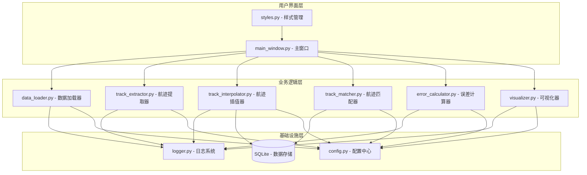
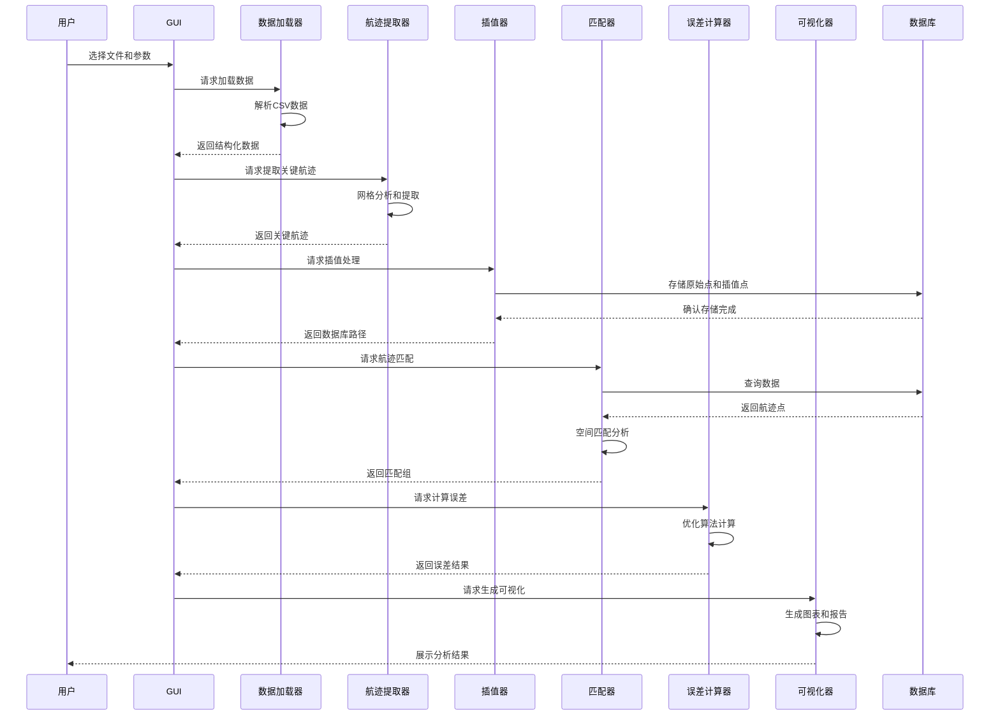
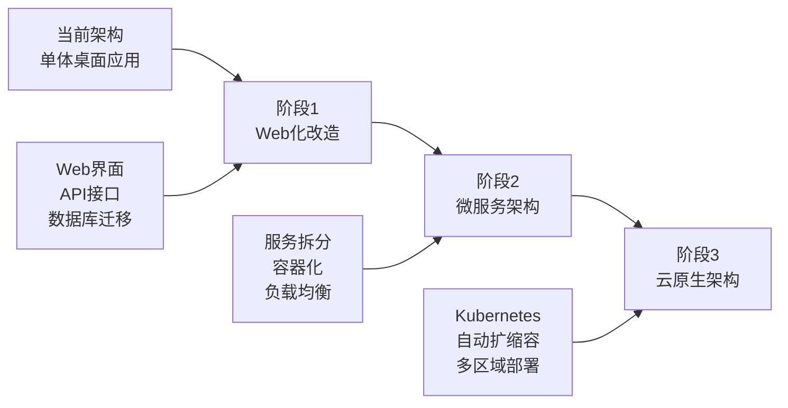

# MRRA 项目架构分析文档

## 1. 项目概述

### 1.1 项目定位
**MRRA** (Multi-Radar Error Analysis) 是一个基于 Python 的雷达系统误差分析工具，专门用于通过多雷达航迹数据匹配来计算和优化各雷达的系统误差。

### 1.2 核心功能
- **数据预处理**：读取 CSV 格式的雷达航迹数据，进行坐标格式转换和时间解析
- **关键航迹提取**：使用空间网格和时间窗口检测持续的关键航迹段
- **航迹插值**：对关键航迹进行时间插值，为匹配准备数据
- **航迹匹配**：基于空间距离阈值匹配不同雷达的航迹点
- **误差计算**：通过优化算法计算雷达系统误差（方位角、距离、俯仰角）
- **可视化**：生成雷达位置和匹配航迹的可视化图表
- **现代 GUI**：基于 wxPython 的直观易用图形用户界面

---

## 2. 技术栈

### 2.1 核心技术栈

| 技术 | 版本 | 用途 |
|------|------|------|
| Python | 3.7+ | 主开发语言 |
| wxPython | 4.2.0+ | GUI 框架 |
| NumPy | 1.21.0+ | 数值计算 |
| Pandas | 1.3.0+ | 数据处理 |
| Matplotlib | 3.5.0+ | 数据可视化 |
| PyProj | 3.3.0+ | 地理坐标计算 |
| SQLite | - | 数据存储 |

### 2.2 设计模式与架构风格
- **架构模式**：分层架构
- **设计模式**：策略模式、工厂模式、单例模式（配置管理）
- **编程范式**：面向对象编程 + 函数式编程混合

---

## 3. 目录结构

```
mrra_20251230_hyb_02/
├── main.py                      # 主入口文件
├── requirements.txt             # 依赖包列表
├── README.md                    # 说明文档
├── src/                         # 源代码目录
│   ├── __init__.py             # 包初始化
│   ├── config.py               # 配置管理（数据中心）
│   ├── logger.py               # 日志系统
│   ├── data_loader.py          # 数据读取与预处理
│   ├── track_extractor.py      # 关键航迹提取
│   ├── track_interpolator.py   # 航迹插值与数据库存储
│   ├── track_matcher.py        # 航迹匹配
│   ├── error_calculator.py     # 雷达误差计算
│   ├── visualizer.py           # 数据可视化
│   └── gui/                    # GUI模块
│       ├── __init__.py
│       ├── main_window.py      # 主窗口
│       └── styles.py           # 界面样式
├── data/                       # 数据目录
│   ├── qb_xp_point_zb_*.xlsx   # 原始数据文件
│   └── 分组结果/               # 分组数据
├── output/                     # 输出目录
│   ├── group1/                 # 分组输出
│   ├── group2/
│   └── group3/
├── analysis_results_*/         # 分析结果文件夹
│   ├── error_results.txt       # 误差分析结果
│   ├── error_visualization.png # 误差可视化图表
│   ├── match_statistics.png    # 匹配统计图表
│   ├── radar_visualization.png # 雷达可视化主图
│   └── match_groups.pkl        # 匹配组数据文件
├── allkeyPot.db                # SQLite 数据库
├── allM.dat                    # 匹配结果缓存
└── out.png                     # 输出图像
```

---

## 4. 模块说明

### 4.1 核心模块架构图



### 4.2 模块详细说明

#### 4.2.1 配置管理模块 (config.py)
**职责**：
- 集中管理所有可配置参数
- 提供配置更新和持久化功能

**核心配置类别**：
- 文件路径配置（数据库、缓存、输出）
- 数据处理配置（网格分辨率、时间窗口、匹配阈值）
- 航迹提取配置（最小点数、时间窗口比例）
- 误差计算配置（优化步长、代价函数权重）
- 可视化配置（显示数量、图像质量）
- 日志配置（级别、格式、输出）
- GUI配置（窗口尺寸、默认路径）

#### 4.2.2 日志系统模块 (logger.py)
**职责**：
- 提供统一的日志记录功能
- 支持控制台、文件和GUI显示

**核心功能**：
- 多级别日志（DEBUG, INFO, WARNING, ERROR, CRITICAL）
- 灵活的输出目标（控制台、文件、GUI）
- 自定义GUI日志处理器

#### 4.2.3 数据加载器模块 (data_loader.py)
**职责**：
- 读取雷达坐标文件
- 加载航迹数据并进行预处理

**核心功能**：
- 解析度分秒格式坐标
- 解析时间字符串
- 数据验证和清洗

**数据流**：
```
CSV文件 → 数据读取 → 坐标解析 → 时间解析 → 数据验证 → 结构化数据
```

#### 4.2.4 航迹提取器模块 (track_extractor.py)
**职责**：
- 从原始航迹数据中提取关键航迹段

**核心算法**：
- 空间网格划分（可配置分辨率）
- 3×3邻域检测
- 时间窗口持续航迹检测

**提取流程**：
```
原始数据 → 网格划分 → 邻域检测 → 持续性判断 → 关键点提取 → 航迹分段
```

#### 4.2.5 航迹插值器模块 (track_interpolator.py)
**职责**：
- 对关键航迹进行时间插值
- 存储到SQLite数据库

**插值策略**：
- 线性插值（基于时间）
- 整数秒点插值
- 原始点保留

**数据库结构**：
- `rf_tb0`: 原始点表
- `rf_tb1`: 插值点表
- 索引：时间、站点

#### 4.2.6 航迹匹配器模块 (track_matcher.py)
**职责**：
- 匹配不同雷达的航迹点

**匹配算法**：
- 基于空间距离阈值
- 避免同雷达站内匹配
- 支持多雷达同时匹配

**匹配流程**：
```
数据库查询 → 时间同步 → 空间距离计算 → 阈值判断 → 匹配组生成
```

#### 4.2.7 误差计算器模块 (error_calculator.py)
**职责**：
- 计算雷达系统误差（方位角、距离、俯仰角）

**优化算法**：
- 梯度下降法
- 多步长逐步优化
- 分模块优化（先方位角，再距离，最后俯仰角）

**代价函数**：
```
总代价 = 方差权重 × 点聚集度方差
       + 方位角权重 × 方位角误差平方
       + 距离权重 × 距离误差平方
       + 俯仰角权重 × 俯仰角误差平方
```

#### 4.2.8 可视化器模块 (visualizer.py)
**职责**：
- 生成雷达位置和匹配航迹的可视化图表

**可视化类型**：
- 雷达位置散点图
- 航迹匹配可视化
- 误差条形图（方位角、距离、俯仰角）
- 匹配统计图表

**输出格式**：
- 高分辨率PNG图像（300 DPI）
- JSON结果导出
- 文本分析报告

#### 4.2.9 GUI模块 (gui/)
**职责**：
- 提供用户交互界面

**界面组成**：
- 主窗口（MainWindow）
- 样式管理
- 控制面板
- 结果展示面板

---

## 5. 数据流说明

### 5.1 完整处理流程



### 5.2 数据格式转换

| 阶段 | 数据格式 | 说明 |
|------|----------|------|
| 原始输入 | CSV文件 | 度分秒格式坐标，时间字符串 |
| 数据加载 | 内存字典 | 站号 → 航迹点列表 |
| 航迹提取 | 字典结构 | 站号 → 航迹段列表 |
| 插值存储 | SQLite | rf_tb0原始表、rf_tb1插值表 |
| 航迹匹配 | 列表结构 | 匹配组列表，每组包含多个雷达点 |
| 误差计算 | 字典结构 | 站号 → (方位角误差, 距离误差, 俯仰角误差) |
| 结果输出 | PNG/JSON/TXT | 可视化图表、JSON数据、文本报告 |

---

## 6. 设计模式与最佳实践

### 6.1 使用的设计模式

#### 6.1.1 分层架构模式
- **表现层**：GUI模块
- **业务逻辑层**：数据处理、提取、匹配、计算模块
- **数据层**：数据库存储、文件I/O

#### 6.1.2 策略模式
- 优化算法的可配置步长序列
- 可插拔的代价函数权重配置

#### 6.1.3 工厂模式
- 日志器创建（setup_logger）
- GUI组件创建

#### 6.1.4 单例模式
- 全局配置对象（config）
- 默认日志器

### 6.2 架构优点

1. **模块化设计**：高内聚低耦合，每个模块职责单一明确
2. **配置驱动**：集中式配置管理，运行时可调整
3. **日志系统完善**：多级别日志记录，支持GUI实时显示
4. **数据持久化**：SQLite数据库存储，匹配结果缓存

### 6.3 可改进之处

1. **错误处理**：部分异常处理不够细致，缺少用户友好的错误提示
2. **测试覆盖**：缺少单元测试，建议添加pytest测试套件
3. **性能优化**：大数据量处理可能内存不足，建议添加分块处理机制
4. **文档完善**：API文档不够详细，建议使用Sphinx生成文档

---

## 7. 核心算法分析

### 7.1 关键航迹提取算法

**算法原理**：
1. 将空间划分为网格
2. 使用时间窗口保持航迹点
3. 检查3×3邻域内的点密度
4. 判断持续性（时间跨度）
5. 提取关键航迹段

**时间复杂度**：O(n × m)，其中n为航迹点数，m为时间窗口大小

**空间复杂度**：O(g² × w)，其中g为网格维度，w为时间窗口

### 7.2 航迹匹配算法

**匹配策略**：
1. 时间同步：按时间戳分组
2. 空间距离计算：欧氏距离
3. 阈值判断：距离小于阈值则匹配
4. 同站过滤：避免同雷达站内匹配

**优化点**：
- 使用索引加速数据库查询
- 时间窗口减少比较次数
- 匹配结果缓存

### 7.3 误差优化算法

**优化方法**：坐标轮换法 (Cyclic Coordinate Descent)

**优化步骤**：
1. 固定距离和俯仰角误差为0，优化方位角误差
2. 固定俯仰角误差为0，优化距离误差
3. 固定方位角和距离误差，优化俯仰角误差
4. 重复1-3直到收敛

**代价函数设计**：
```
总代价 = w₁ × σ² + w₂ × Σ(Δaz²) + w₃ × Σ(Δr²) + w₄ × Σ(Δel²)
```
其中：
- σ²：匹配点聚集度方差
- Δaz：方位角误差
- Δr：距离误差
- Δel：俯仰角误差
- w₁, w₂, w₃, w₄：权重系数

---

## 8. 数据库设计

### 8.1 数据库表结构

**rf_tb0 (原始点表)**：
```sql
CREATE TABLE rf_tb0 (
    station_id INTEGER,      -- 站号
    track_id INTEGER,        -- 批号
    time_seconds REAL,       -- 时间（秒）
    longitude REAL,          -- 经度
    latitude REAL,           -- 纬度
    altitude REAL,           -- 高度
    segment_index INTEGER    -- 航迹段索引
);
```

**rf_tb1 (插值点表)**：
```sql
CREATE TABLE rf_tb1 (
    station_id INTEGER,      -- 站号
    track_id INTEGER,        -- 批号
    time_seconds REAL,       -- 时间（秒）
    longitude REAL,          -- 经度
    latitude REAL,           -- 纬度
    altitude REAL,           -- 高度
    segment_index INTEGER    -- 航迹段索引
);
```

---

## 9. 输出文件说明

| 文件 | 格式 | 说明 |
|------|------|------|
| error_results.txt | 文本 | 误差分析结果和统计 |
| error_visualization.png | 图像 | 误差可视化（四个子图） |
| match_statistics.png | 图像 | 匹配组大小分布 |
| radar_visualization.png | 图像 | 雷达位置和航迹匹配 |
| match_groups.pkl | 二进制 | 匹配组原始数据 |

---

## 10. 与RFTIP项目的对比分析

### 10.1 架构对比

| 方面 | MRRA | RFTIP |
|------|------|-------|
| 架构模式 | 分层架构 | 前后端分离 |
| 前端技术 | wxPython (桌面GUI) | Next.js + React (Web) |
| 后端技术 | Python (单体应用) | Node.js + Express |
| 数据库 | SQLite | PostgreSQL + Supabase |
| 部署方式 | 桌面应用 | Web应用 |
| 实时通信 | 无 | WebSocket/Supabase订阅 |

### 10.2 功能对比

| 功能 | MRRA | RFTIP |
|------|------|-------|
| 雷达误差分析 | ✓ | ✓ |
| 航迹预处理 | ✓ | ✓ |
| 航迹匹配 | ✓ | ✓ |
| 误差计算 | ✓ | ✓ |
| 可视化 | 桌面图表 | Web图表 |
| 实时更新 | 无 | 有 |
| 多用户协作 | 无 | 支持 |

### 10.3 可借鉴的设计

**从RFTIP可以借鉴：**
1. 前后端分离架构
2. 实时通信机制
3. Web界面
4. 多用户协作
5. 云数据库

**从MRRA可以借鉴：**
1. 算法优化
2. 集中式配置设计
3. 完善的日志机制
4. SQLite缓存策略

---

## 11. 总结与建议

### 11.1 项目总结

MRRA项目是一个设计良好的雷达误差分析工具，具有以下特点：

**优势：**
- 清晰的模块化架构
- 成熟的算法实现
- 友好的桌面GUI
- 完善的配置管理
- 丰富的可视化输出

**不足：**
- 缺少单元测试
- 大数据量性能有限
- 不支持多用户协作
- 缺少Web界面

### 11.2 改进建议

**短期改进：**
1. 添加单元测试覆盖
2. 完善错误处理机制
3. 优化大数据量处理性能
4. 增加算法性能监控

**长期改进：**
1. 考虑前后端分离架构
2. 添加Web界面
3. 支持多用户协作
4. 引入机器学习优化算法
5. 支持分布式计算

### 11.3 架构演进建议



---

## 附录

### A. 配置参数完整列表

| 参数 | 默认值 | 说明 |
|------|--------|------|
| GRID_RESOLUTION | 0.2 | 网格分辨率（度） |
| TIME_WINDOW | 60 | 时间窗口长度（秒） |
| MATCH_DISTANCE_THRESHOLD | 0.12 | 匹配距离阈值（度） |
| MIN_TRACK_POINTS | 10 | 最小航迹点数 |
| OPTIMIZATION_STEPS | (0.1, 0.01) | 方位角优化步长 |
| COST_WEIGHT_VARIANCE | 100.0 | 方差权重 |
| COST_WEIGHT_AZIMUTH_ERROR_SQUARE | 0.15 | 方位角误差权重 |
| COST_WEIGHT_RANGE_ERROR_SQUARE | 6e-7 | 距离误差权重 |
| COST_WEIGHT_ELEVATION_ERROR_SQUARE | 0.1 | 俯仰角误差权重 |
| MAX_MATCH_GROUPS | 15000 | 最大匹配组数 |

---

**文档版本**：v1.0
**生成时间**：2025-03-22
**项目路径**：D:\myworld\毕设\学姐做的\mrra_20251230_hyb_02\mrra_20251230_hyb_02
**分析工具**：Claude Code Architecture Analysis
