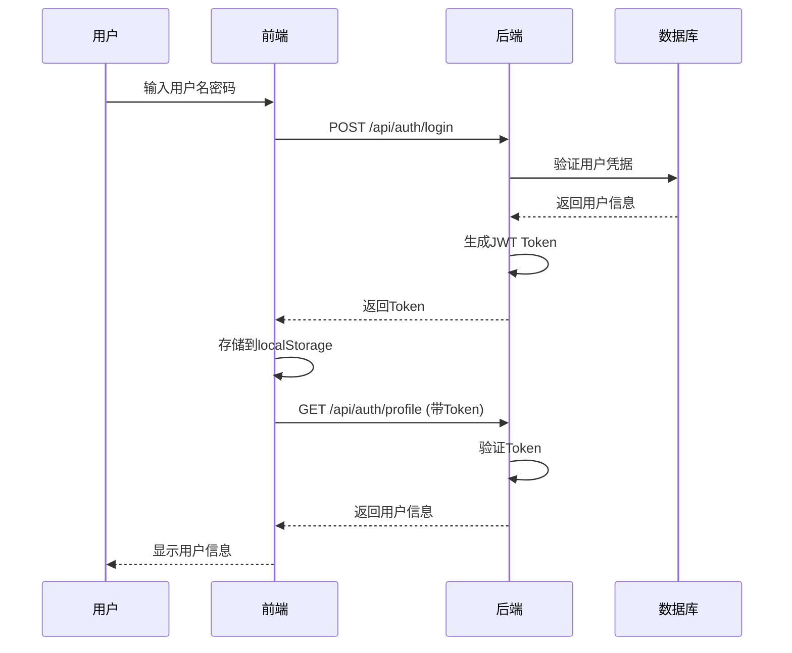
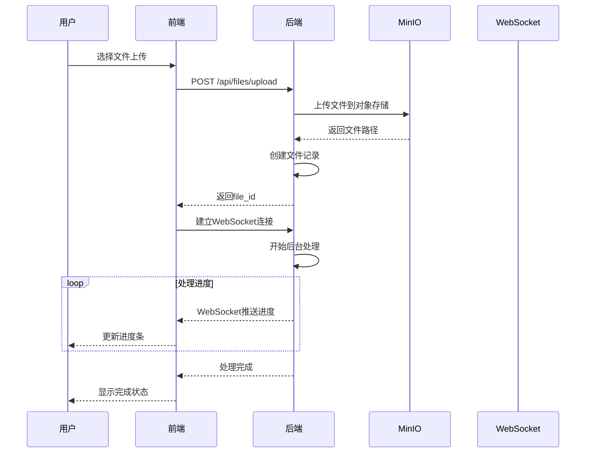

# RFTIP 项目架构分析文档

## 1. 项目概述

**RFTIP** (Radar Fusion Track Intelligence Platform) 是一个智能雷达轨迹分析与可视化系统，采用前后端分离架构。该系统集成了多算法误差分析、轨迹优化估计、大模型轨迹分析以及禁飞区检测等功能。

### 1.1 核心功能模块
- 用户认证与权限管理
- 雷达数据文件管理（上传、解析、预处理）
- 轨迹数据可视化（3D可视化、地图展示）
- 轨迹分析与处理（RANSAC、卡尔曼滤波）
- 禁飞区管理与入侵检测
- AI驱动的轨迹分析

---

## 2. 技术栈

### 2.1 前端技术栈

| 类别 | 技术 | 版本 | 用途 |
|------|------|------|------|
| 核心框架 | Vue.js | 3.5.26 | 渐进式前端框架 |
| 状态管理 | Pinia | 3.0.4 | 官方推荐状态管理库 |
| 路由管理 | Vue Router | 4.6.4 | 官方路由管理器 |
| 构建工具 | Vite | 7.3.1 | 下一代前端构建工具 |
| 语言 | TypeScript | 5.9.3 | 类型安全的JavaScript超集 |
| HTTP客户端 | Axios | 1.13.5 | HTTP请求库 |
| 3D可视化 | Three.js | 0.182.0 | WebGL 3D渲染库 |
| 地球可视化 | three-globe | 2.45.0 | 地球3D可视化组件 |
| 地图可视化 | Leaflet | 1.9.4 | 2D地图交互库 |
| 样式框架 | Tailwind CSS | 3.4.19 | 实用优先的CSS框架 |

### 2.2 后端技术栈

| 类别 | 技术 | 版本 | 用途 |
|------|------|------|------|
| Web框架 | FastAPI | 0.115.0 | 现代高性能Python Web框架 |
| ASGI服务器 | Uvicorn | 0.32.1 | 高性能ASGI服务器 |
| 数据库ORM | SQLAlchemy | 2.0.36 | Python SQL工具包和ORM |
| 数据库驱动 | PyMySQL | 1.1.1 | 纯Python MySQL客户端 |
| 缓存 | Redis | 5.2.1 | 内存数据结构存储 |
| 对象存储 | MinIO | 7.2.8 | 高性能对象存储 |
| 数据处理 | NumPy | 1.26.4 | 科学计算基础库 |
| 数据处理 | Pandas | 2.2.3 | 数据分析与处理 |
| 机器学习 | scikit-learn | 1.5.2 | 机器学习算法库 |
| 滤波算法 | filterpy | 1.4.5 | 卡尔曼滤波等算法 |
| 安全认证 | python-jose | 3.3.0 | JWT令牌处理 |
| 密码加密 | passlib | 1.7.4 | 密码哈希库 |

---

## 3. 项目目录结构

```
RFTIP/
├── frontend/                 # 前端Vue3项目
│   ├── src/
│   │   ├── api/             # API接口层
│   │   │   ├── auth.ts      # 认证API
│   │   │   ├── files.ts     # 文件管理API
│   │   │   ├── tracks.ts    # 轨迹API
│   │   │   ├── zones.ts     # 禁飞区API
│   │   │   ├── analysis.ts  # 分析API
│   │   │   ├── client.ts    # Axios客户端配置
│   │   │   └── types.ts     # TypeScript类型定义
│   │   ├── components/      # 可复用组件
│   │   │   ├── AppHeader.vue
│   │   │   ├── EarthGlobe.vue    # 3D地球组件
│   │   │   ├── ThreeRadar.vue    # 3D雷达组件
│   │   │   ├── TrajectoryLight.vue
│   │   │   ├── TrajectoryDark.vue
│   │   │   ├── Toast.vue         # 通知组件
│   │   │   └── Loading.vue       # 加载组件
│   │   ├── views/           # 页面组件
│   │   │   ├── Home.vue            # 首页
│   │   │   ├── Login.vue           # 登录页
│   │   │   ├── Register.vue        # 注册页
│   │   │   ├── Dashboard.vue       # 仪表板
│   │   │   ├── DataManagement.vue  # 数据管理
│   │   │   ├── FileDetails.vue     # 文件详情
│   │   │   ├── TrackVisualization.vue  # 轨迹可视化
│   │   │   ├── TrackDetails.vue    # 轨迹详情
│   │   │   ├── ZoneManagement.vue  # 禁飞区管理
│   │   │   ├── Analysis.vue        # AI分析
│   │   │   └── Profile.vue         # 用户资料
│   │   ├── stores/          # Pinia状态管理
│   │   │   ├── auth.ts      # 认证状态
│   │   │   ├── app.ts       # 应用状态
│   │   │   ├── file.ts      # 文件状态
│   │   │   └── theme.ts     # 主题状态
│   │   ├── router/          # 路由配置
│   │   ├── utils/           # 工具函数
│   │   ├── composables/     # 组合式函数
│   │   ├── assets/          # 静态资源
│   │   ├── App.vue          # 根组件
│   │   └── main.ts          # 入口文件
│   ├── vite.config.ts       # Vite配置
│   ├── tsconfig.json        # TypeScript配置
│   └── package.json         # 依赖配置
│
├── backend/                 # 后端FastAPI项目
│   ├── app/
│   │   ├── api/            # API路由
│   │   │   ├── auth.py     # 认证路由
│   │   │   ├── files.py    # 文件管理路由
│   │   │   ├── tracks.py   # 轨迹路由
│   │   │   ├── zones.py    # 禁飞区路由
│   │   │   └── analysis.py # 分析路由
│   │   ├── core/           # 核心配置
│   │   │   ├── config.py   # 配置管理
│   │   │   └── security.py # 安全相关
│   │   ├── models/         # 数据模型
│   │   ├── schemas/        # Pydantic模式
│   │   ├── services/       # 业务逻辑层
│   │   ├── utils/          # 工具函数
│   │   │   ├── preprocessing.py  # 轨迹预处理
│   │   │   ├── algorithms.py     # 算法实现
│   │   │   └── validators.py     # 验证器
│   │   ├── db/             # 数据库
│   │   ├── main.py         # FastAPI应用入口
│   │   └── dependencies.py # 依赖注入
│   └── requirements.txt    # Python依赖
│
└── docs/                   # 项目文档
```

---

## 4. 系统架构

### 4.1 整体架构图

```
┌─────────────────────────────────────────────────────────────────┐
│                         前端层 (Vue.js 3)                        │
├─────────────────────────────────────────────────────────────────┤
│  Vue.js 3 + TypeScript + Pinia + Vue Router + Tailwind CSS     │
│                                                                  │
│  ┌──────────────┬──────────────┬──────────────┬──────────────┐  │
│  │  认证模块    │  数据管理    │  可视化模块  │  分析模块    │  │
│  └──────────────┴──────────────┴──────────────┴──────────────┘  │
└─────────────────────────────────────────────────────────────────┘
                                  │
                                  ▼
┌─────────────────────────────────────────────────────────────────┐
│                         API网关层 (FastAPI)                      │
├─────────────────────────────────────────────────────────────────┤
│              FastAPI + Uvicorn (ASGI Server)                    │
│                                                                  │
│  ┌──────────────────────────────────────────────────────────┐  │
│  │  中间件层                                                  │  │
│  │  • CORS中间件    • 认证中间件    • 日志中间件             │  │
│  └──────────────────────────────────────────────────────────┘  │
└─────────────────────────────────────────────────────────────────┘
                                  │
                                  ▼
┌─────────────────────────────────────────────────────────────────┐
│                       业务逻辑层 (Services)                      │
├─────────────────────────────────────────────────────────────────┤
│  ┌──────────────┬──────────────┬──────────────┬──────────────┐  │
│  │  认证服务    │  文件服务    │  轨迹服务    │  分析服务    │  │
│  └──────────────┴──────────────┴──────────────┴──────────────┘  │
│                                                                  │
│  ┌──────────────────────────────────────────────────────────┐  │
│  │  算法层                                                    │  │
│  │  • RANSAC算法    • 卡尔曼滤波    • 粒子滤波              │  │
│  └──────────────────────────────────────────────────────────┘  │
└─────────────────────────────────────────────────────────────────┘
                                  │
                                  ▼
┌─────────────────────────────────────────────────────────────────┐
│                         数据存储层                                │
├─────────────────────────────────────────────────────────────────┤
│  ┌──────────────┬──────────────┬──────────────┬──────────────┐  │
│  │   MySQL      │    Redis     │    MinIO     │  文件系统    │  │
│  │  (主数据库)  │   (缓存)     │  (对象存储)  │  (临时文件)  │  │
│  └──────────────┴──────────────┴──────────────┴──────────────┘  │
└─────────────────────────────────────────────────────────────────┘
```

### 4.2 前端架构

```
┌─────────────────────────────────────────────────────────────┐
│                     应用入口 (main.ts)                       │
└─────────────────────────────────────────────────────────────┘
                          │
                          ▼
┌─────────────────────────────────────────────────────────────┐
│                   根组件 (App.vue)                           │
│  ┌─────────────────────────────────────────────────────┐    │
│  │  路由视图 (RouterView)                              │    │
│  └─────────────────────────────────────────────────────┘    │
└─────────────────────────────────────────────────────────────┘
                          │
                          ▼
┌─────────────────────────────────────────────────────────────┐
│                    页面组件 (Views)                           │
│  ┌──────────┬──────────┬──────────┬──────────┬──────────┐    │
│  │  Home    │ Dashboard│  Data    │  Track   │ Analysis │    │
│  │          │          │Management│Visualization│          │    │
│  └──────────┴──────────┴──────────┴──────────┴──────────┘    │
└─────────────────────────────────────────────────────────────┘
                          │
                          ▼
┌─────────────────────────────────────────────────────────────┐
│                    业务组件 (Components)                      │
│  ┌──────────────┬──────────────┬──────────────┬────────────┐  │
│  │ AppHeader    │ EarthGlobe   │ ThreeRadar   │ DataTable  │  │
│  │ FileUploader │ Trajectory   │ ConfirmDialog│ Toast      │  │
│  └──────────────┴──────────────┴──────────────┴────────────┘  │
└─────────────────────────────────────────────────────────────┘
                          │
                          ▼
┌─────────────────────────────────────────────────────────────┐
│                    状态层 (Pinia Stores)                      │
│  • auth store (用户认证)                                      │
│  • app store (应用状态)                                       │
│  • file store (文件状态)                                      │
│  • theme store (主题状态)                                     │
└─────────────────────────────────────────────────────────────┘
                          │
                          ▼
┌─────────────────────────────────────────────────────────────┐
│                    API层 (API Client)                         │
│  • Axios (请求拦截器、响应拦截器)                             │
│  • apiCall包装器 (统一错误处理)                               │
│  • API Modules (auth, files, tracks, zones, analysis)        │
└─────────────────────────────────────────────────────────────┘
```

---

## 5. 核心模块说明

### 5.1 认证模块

**功能：**
- 用户注册（支持头像上传）
- 用户登录（JWT Token认证）
- 密码修改
- 用户资料管理
- 登录日志记录

**技术实现：**
- JWT Token认证
- 密码bcrypt加密
- Token存储在localStorage
- Axios拦截器自动添加Token

### 5.2 文件管理模块

**功能：**
- 单文件/批量文件上传
- 文件列表查询（分页、筛选、搜索）
- 文件处理状态实时监控
- 文件分享（生成分享链接、二维码）
- 文件删除

**技术实现：**
- 异步文件处理（后台任务）
- WebSocket实时进度推送
- MinIO对象存储
- 文件分类（轨迹数据/雷达站数据）

### 5.3 轨迹可视化模块

**功能：**
- 3D地球可视化（Three.js + three-globe）
- 轨迹3D可视化（Three.js）
- 2D地图可视化（Leaflet）
- 轨迹颜色、粗细等显示设置
- 视图控制（3D/2D切换）

**核心组件：**
- `EarthGlobe.vue` - 3D地球可视化
- `ThreeRadar.vue` - 3D雷达可视化
- `TrajectoryLight.vue` - 亮色主题轨迹
- `TrajectoryDark.vue` - 深色主题轨迹

### 5.4 轨迹处理模块

**功能：**
- 轨迹数据预处理
- RANSAC算法误差检测
- 卡尔曼滤波轨迹平滑
- 粒子滤波轨迹预测
- 异常值检测与过滤

**算法实现：**
- RANSAC（随机采样一致算法）
- 卡尔曼滤波
- 粒子滤波
- 加权最小二乘法

### 5.5 禁飞区管理模块

**功能：**
- 禁飞区创建（圆形/多边形）
- 禁飞区列表管理
- 禁飞区启用/禁用
- 入侵检测
- 入侵记录查询

### 5.6 AI分析模块

**功能：**
- 整体轨迹分析
- 分段轨迹分析
- LLM智能分析
- 特征提取
- 分析报告生成（PDF/JSON）

---

## 6. 数据流说明

### 6.1 用户认证流程



### 6.2 文件上传与处理流程



---

## 7. API设计

### 7.1 API响应格式

**成功响应：**
```json
{
  "code": 200,
  "message": "success",
  "data": { ... }
}
```

**错误响应：**
```json
{
  "code": 400,
  "message": "error message",
  "detail": "detailed error"
}
```

### 7.2 主要API端点

| 模块 | 端点 | 方法 | 描述 |
|------|------|------|------|
| 认证 | /api/auth/login | POST | 用户登录 |
| 认证 | /api/auth/register | POST | 用户注册 |
| 认证 | /api/auth/profile | GET | 获取用户信息 |
| 文件 | /api/files/upload | POST | 上传文件 |
| 文件 | /api/files/ | GET | 获取文件列表 |
| 文件 | /api/files/{id} | GET | 获取文件详情 |
| 文件 | /api/files/{id} | DELETE | 删除文件 |
| 轨迹 | /api/tracks/raw | GET | 获取原始轨迹 |
| 轨迹 | /api/tracks/corrected | GET | 获取校正轨迹 |
| 轨迹 | /api/tracks/summary | GET | 获取轨迹汇总 |
| 禁飞区 | /api/zones/ | POST | 创建禁飞区 |
| 禁飞区 | /api/zones/ | GET | 获取禁飞区列表 |
| 禁飞区 | /api/zones/{id} | DELETE | 删除禁飞区 |
| 分析 | /api/analysis/trajectory | POST | 轨迹分析 |
| WebSocket | /api/ws/files/{id} | WS | 文件处理进度 |

---

## 8. 数据库设计

### 8.1 主要数据表

**users表**
- id (主键)
- username (唯一)
- email (唯一)
- password_hash
- avatar_url
- is_active
- created_at
- updated_at

**data_files表**
- id (主键)
- filename
- original_filename
- file_size
- file_type
- category (trajectory/radar_station)
- status (pending/processing/completed/failed)
- user_id (外键)
- upload_time
- processed_time

**tracks表**
- track_id (主键)
- file_id (外键)
- start_time
- end_time
- point_count

**track_points表**
- id (主键)
- track_id (外键)
- timestamp
- longitude
- latitude
- altitude
- speed
- heading

**no_fly_zones表**
- id (主键)
- zone_name
- zone_type (circle/polygon)
- coordinates (JSON)
- is_active

---

## 9. 设计模式与最佳实践

### 9.1 前端设计模式

1. **状态管理模式** - Pinia集中式状态管理
2. **API调用模式** - apiCall包装器统一错误处理
3. **组件设计模式** - 容器/展示组件分离
4. **路由守卫模式** - 路由级权限控制
5. **主题切换模式** - CSS变量动态切换

### 9.2 后端设计模式

1. **分层架构** - API层/Service层/Model层
2. **依赖注入** - FastAPI Depends实现
3. **异步处理** - 后台任务+WebSocket推送
4. **中间件模式** - CORS/认证/日志中间件
5. **数据验证** - Pydantic模型验证

---

## 10. 安全设计

### 10.1 前端安全
- JWT Token存储
- 自动Token刷新
- XSS防护（Vue自动转义）
- CSRF防护（SameSite Cookie）

### 10.2 后端安全
- 密码bcrypt加密
- JWT Token认证
- CORS配置
- 输入验证（Pydantic）
- SQL注入防护（ORM参数化）
- 速率限制

---

## 11. 性能优化

### 11.1 前端优化
- 代码分割（Vite）
- 组件懒加载
- 图片懒加载
- 虚拟滚动
- 防抖/节流

### 11.2 后端优化
- 数据库索引
- Redis缓存
- 异步处理
- 连接池
- 查询优化

---

## 12. 总结

RFTIP是一个设计良好的现代化Web应用，具有以下特点：

**优势：**
1. 前后端分离架构，职责清晰
2. TypeScript/Python类型安全
3. 组件化设计，可复用性强
4. API设计RESTful
5. 3D可视化技术先进
6. 算法模块化，易于扩展

**可改进点：**
1. 添加单元测试和E2E测试
2. 添加API文档（Swagger）
3. 添加性能监控
4. 添加错误追踪（Sentry）
5. 优化大文件上传（断点续传）
6. 添加数据备份策略

---

**文档生成时间：** 2025-03-22
**项目路径：** D:\myworld\毕设\RFTIP
**分析工具：** Claude Code Architecture Analysis
