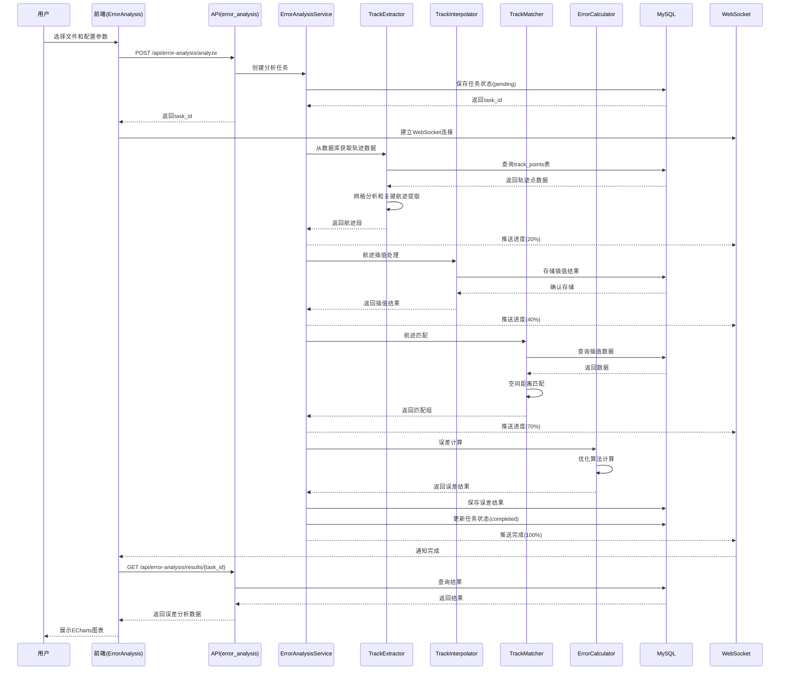
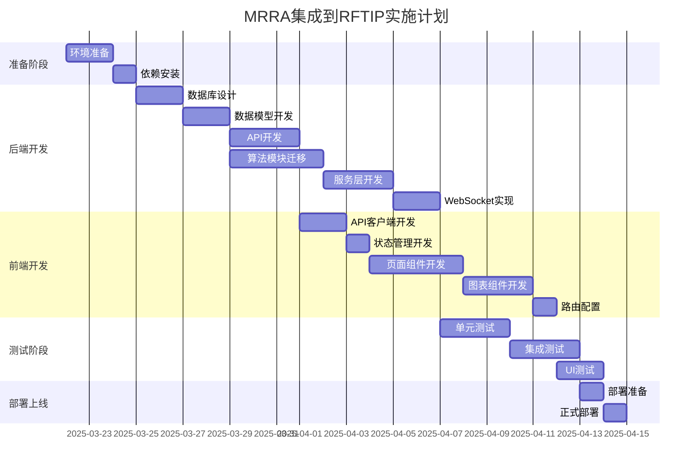

# MRRA 项目集成到 RFTIP 的详细实施计划

## 文档信息

| 项目 | 内容 |
|------|------|
| 文档版本 | v1.0 |
| 创建时间 | 2025-03-22 |
| 目标项目 | RFTIP (Radar Fusion Track Intelligence Platform) |
| 源项目 | MRRA (Multi-Radar Error Analysis) |
| 集成类型 | 功能模块集成 |

---

## 1. 项目概述

### 1.1 集成目标

将 MRRA (Multi-Radar Error Analysis) 项目的雷达误差分析功能集成到 RFTIP 项目中，作为 RFTIP 的一个独立算法模块。

### 1.2 核心需求

| 需求项 | 说明 |
|--------|------|
| 数据源迁移 | 使用 RFTIP 的数据（不再使用 MRRA 的 CSV 文件） |
| 数据库迁移 | 从 SQLite 迁移到 MySQL |
| 后端集成 | 将 MRRA 核心算法模块集成到 FastAPI 后端 |
| 前端集成 | 开发 Web 界面替代 wxPython 桌面 GUI |
| 算法保留 | 保持 MRRA 的核心算法功能完整性 |

### 1.3 架构对比分析

| 方面 | MRRA | RFTIP | 集成方案 |
|------|------|-------|----------|
| 架构模式 | 单体应用（桌面） | 前后端分离（Web） | MRRA算法作为后端服务 |
| 前端技术 | wxPython (桌面GUI) | Vue 3 + TypeScript | 新增Web误差分析页面 |
| 后端技术 | Python (单体) | FastAPI + SQLAlchemy | 集成到FastAPI服务层 |
| 数据库 | SQLite | MySQL | 迁移到MySQL |
| 数据源 | CSV 文件 | 数据库 + MinIO | 使用RFTIP数据模型 |
| 可视化 | Matplotlib | ECharts + Three.js | 使用ECharts展示误差分析 |
| 实时通信 | 无 | WebSocket | 增加实时进度推送 |

---

## 2. 集成架构设计

### 2.1 整体集成架构

```
┌─────────────────────────────────────────────────────────────────────────────┐
│                              前端层 (Vue.js 3)                                │
│  ┌──────────────┬──────────────┬──────────────┬──────────────────────────┐  │
│  │  认证模块    │  数据管理    │  轨迹可视化  │     误差分析模块 (新增)   │  │
│  │              │              │              │                          │  │
│  │              │              │              │  • ErrorAnalysis.vue     │  │
│  │              │              │              │  • 误差参数配置           │  │
│  │              │              │              │  • ECharts图表展示        │  │
│  └──────────────┴──────────────┴──────────────┴──────────────────────────┘  │
└─────────────────────────────────────────────────────────────────────────────┘
                                          │
                                          ▼
┌─────────────────────────────────────────────────────────────────────────────┐
│                           API网关层 (FastAPI)                                 │
│  ┌──────────────┬──────────────┬──────────────┬──────────────────────────┐  │
│  │  auth        │  files       │  tracks      │   error_analysis (新增)  │  │
│  │              │              │              │                          │  │
│  │              │              │              │  • POST /analyze          │  │
│  │              │              │              │  • GET /results           │  │
│  │              │              │              │  • GET /config            │  │
│  │              │              │              │  • WS /progress           │  │
│  └──────────────┴──────────────┴──────────────┴──────────────────────────┘  │
└─────────────────────────────────────────────────────────────────────────────┘
                                          │
                                          ▼
┌─────────────────────────────────────────────────────────────────────────────┐
│                            业务逻辑层 (Services)                              │
│  ┌──────────────┬──────────────┬──────────────┬──────────────────────────┐  │
│  │  auth        │  files       │  tracks      │   ErrorAnalysisService   │  │
│  │  Service     │  Service     │  Service     │        (新增)            │  │
│  └──────────────┴──────────────┴──────────────┴──────────────────────────┘  │
│                                                                                  │
│  ┌────────────────────────────────────────────────────────────────────────┐   │
│  │                         算法层 (utils/algorithms/)                      │   │
│  │  ┌──────────────────────┬──────────────────────────────────────────┐   │   │
│  │  │ RFTIP现有算法        │    MRRA集成算法 (新增)                    │   │   │
│  │  │ • RANSAC             │                                          │   │   │
│  │  │ • 卡尔曼滤波          │  • TrackExtractor (航迹提取)             │   │   │
│  │  │ • 粒子滤波            │  • TrackInterpolator (航迹插值)          │   │   │
│  │  │                      │  • TrackMatcher (航迹匹配)                │   │   │
│  │  │                      │  • ErrorCalculator (误差计算)             │   │   │
│  │  └──────────────────────┴──────────────────────────────────────────┘   │   │
│  └────────────────────────────────────────────────────────────────────────┘   │
└─────────────────────────────────────────────────────────────────────────────┘
                                          │
                                          ▼
┌─────────────────────────────────────────────────────────────────────────────┐
│                                数据存储层                                     │
│  ┌──────────────┬──────────────┬──────────────┬──────────────────────────┐  │
│  │   MySQL      │    Redis     │    MinIO     │   error_analysis (新增)  │  │
│  │              │              │              │                          │  │
│  │  • users     │  • 缓存      │  • 文件存储  │  • error_analysis_tasks │  │
│  │  • data_files│              │              │  • track_segments       │  │
│  │  • tracks    │              │              │  • match_groups         │  │
│  │  • track_pts │              │              │  • error_results        │  │
│  └──────────────┴──────────────┴──────────────┴──────────────────────────┘  │
└─────────────────────────────────────────────────────────────────────────────┘
```

### 2.2 数据流设计



---

## 3. 后端集成计划

### 3.1 目录结构扩展

```
backend/app/
├── api/
│   ├── auth.py
│   ├── files.py
│   ├── tracks.py
│   ├── zones.py
│   ├── analysis.py
│   └── error_analysis.py          # 新增：误差分析API
│
├── services/
│   ├── auth_service.py
│   ├── file_service.py
│   ├── track_service.py
│   ├── analysis_service.py
│   └── error_analysis_service.py  # 新增：误差分析服务
│
├── models/
│   ├── user.py
│   ├── file.py
│   ├── track.py
│   ├── zone.py
│   └── error_analysis.py         # 新增：误差分析数据模型
│
├── schemas/
│   ├── user.py
│   ├── file.py
│   ├── track.py
│   ├── zone.py
│   └── error_analysis.py         # 新增：误差分析API模式
│
└── utils/
    ├── preprocessing.py
    ├── algorithms.py
    ├── validators.py
    └── mrra/                      # 新增：MRRA算法模块
        ├── __init__.py
        ├── track_extractor.py     # 航迹提取器
        ├── track_interpolator.py  # 航迹插值器
        ├── track_matcher.py       # 航迹匹配器
        ├── error_calculator.py    # 误差计算器
        └── config.py              # MRRA配置管理
```

### 3.2 数据库设计

#### 3.2.1 新增数据表

**error_analysis_tasks (误差分析任务表)**
```sql
CREATE TABLE error_analysis_tasks (
    id INT PRIMARY KEY AUTO_INCREMENT,
    task_id VARCHAR(36) UNIQUE NOT NULL COMMENT '任务UUID',
    file_id INT NOT NULL COMMENT '关联文件ID',
    user_id INT NOT NULL COMMENT '创建用户ID',

    -- 配置参数
    config JSON COMMENT '分析配置参数',

    -- 状态
    status ENUM('pending', 'extracting', 'interpolating', 'matching', 'calculating', 'completed', 'failed') DEFAULT 'pending',
    progress INT DEFAULT 0 COMMENT '进度百分比',
    error_message TEXT COMMENT '错误信息',

    -- 时间
    created_at TIMESTAMP DEFAULT CURRENT_TIMESTAMP,
    started_at TIMESTAMP NULL,
    completed_at TIMESTAMP NULL,

    FOREIGN KEY (file_id) REFERENCES data_files(id),
    FOREIGN KEY (user_id) REFERENCES users(id),
    INDEX idx_task_id (task_id),
    INDEX idx_user_id (user_id),
    INDEX idx_status (status)
);
```

**track_segments (航迹段表)**
```sql
CREATE TABLE track_segments (
    id INT PRIMARY KEY AUTO_INCREMENT,
    task_id VARCHAR(36) NOT NULL COMMENT '关联任务ID',
    segment_id INT NOT NULL COMMENT '段号',

    -- 航迹信息
    station_id INT NOT NULL COMMENT '雷达站号',
    track_id INT NOT NULL COMMENT '航迹批号',
    start_time TIMESTAMP NOT NULL COMMENT '开始时间',
    end_time TIMESTAMP NOT NULL COMMENT '结束时间',
    point_count INT NOT NULL COMMENT '点数',

    -- 关键点索引
    start_point_index INT COMMENT '起始点索引',
    end_point_index INT COMMENT '结束点索引',

    created_at TIMESTAMP DEFAULT CURRENT_TIMESTAMP,

    FOREIGN KEY (task_id) REFERENCES error_analysis_tasks(task_id) ON DELETE CASCADE,
    INDEX idx_task_id (task_id),
    INDEX idx_station_track (station_id, track_id)
);
```

**match_groups (匹配组表)**
```sql
CREATE TABLE match_groups (
    id INT PRIMARY KEY AUTO_INCREMENT,
    task_id VARCHAR(36) NOT NULL COMMENT '关联任务ID',
    group_id INT NOT NULL COMMENT '匹配组号',

    -- 匹配点信息
    match_time TIMESTAMP NOT NULL COMMENT '匹配时间',
    match_points JSON NOT NULL COMMENT '匹配点列表 [{station_id, point_id, lon, lat, alt}]',
    point_count INT NOT NULL COMMENT '匹配点数量',

    -- 质量指标
    avg_distance FLOAT COMMENT '平均距离',
    max_distance FLOAT COMMENT '最大距离',
    variance FLOAT COMMENT '距离方差',

    created_at TIMESTAMP DEFAULT CURRENT_TIMESTAMP,

    FOREIGN KEY (task_id) REFERENCES error_analysis_tasks(task_id) ON DELETE CASCADE,
    INDEX idx_task_id (task_id),
    INDEX idx_match_time (match_time)
);
```

**error_results (误差结果表)**
```sql
CREATE TABLE error_results (
    id INT PRIMARY KEY AUTO_INCREMENT,
    task_id VARCHAR(36) NOT NULL COMMENT '关联任务ID',

    -- 雷达站信息
    station_id INT NOT NULL COMMENT '雷达站号',

    -- 误差值
    azimuth_error FLOAT DEFAULT 0 COMMENT '方位角误差(度)',
    range_error FLOAT DEFAULT 0 COMMENT '距离误差(米)',
    elevation_error FLOAT DEFAULT 0 COMMENT '俯仰角误差(度)',

    -- 统计信息
    match_count INT DEFAULT 0 COMMENT '匹配点数量',
    confidence FLOAT COMMENT '置信度',

    -- 优化信息
    iterations INT COMMENT '优化迭代次数',
    final_cost FLOAT COMMENT '最终代价函数值',

    created_at TIMESTAMP DEFAULT CURRENT_TIMESTAMP,

    FOREIGN KEY (task_id) REFERENCES error_analysis_tasks(task_id) ON DELETE CASCADE,
    UNIQUE KEY uk_task_station (task_id, station_id),
    INDEX idx_task_id (task_id)
);
```

#### 3.2.2 数据迁移映射

| MRRA SQLite | RFTIP MySQL | 说明 |
|-------------|-------------|------|
| rf_tb0 | track_points (使用现有表) | 原始点表，直接使用RFTIP的track_points |
| rf_tb1 | track_interpolated_points (新增) | 插值点表 |
| CSV文件 | data_files + track_points | 使用RFTIP数据模型 |
| allM.dat (缓存) | match_groups | 匹配结果缓存 |

### 3.3 API设计

#### 3.3.1 新增API端点

| 端点 | 方法 | 描述 |
|------|------|------|
| /api/error-analysis/config | GET | 获取默认配置 |
| /api/error-analysis/analyze | POST | 创建分析任务 |
| /api/error-analysis/tasks | GET | 获取任务列表 |
| /api/error-analysis/tasks/{id} | GET | 获取任务详情 |
| /api/error-analysis/tasks/{id}/results | GET | 获取分析结果 |
| /api/error-analysis/tasks/{id}/segments | GET | 获取航迹段 |
| /api/error-analysis/tasks/{id}/matches | GET | 获取匹配组 |
| /api/error-analysis/tasks/{id}/chart | GET | 获取图表数据 |
| /api/error-analysis/tasks/{id}/export | GET | 导出结果 |
| /ws/error-analysis/{id} | WS | 实时进度推送 |

#### 3.3.2 API请求/响应格式

**1. 创建分析任务**

```http
POST /api/error-analysis/analyze
Content-Type: application/json

{
  "file_id": 123,
  "config": {
    "grid_resolution": 0.2,
    "time_window": 60,
    "match_distance_threshold": 0.12,
    "min_track_points": 10,
    "optimization_steps": [0.1, 0.01],
    "cost_weights": {
      "variance": 100.0,
      "azimuth": 0.15,
      "range": 6e-7,
      "elevation": 0.1
    },
    "max_match_groups": 15000
  }
}
```

```json
{
  "code": 200,
  "message": "success",
  "data": {
    "task_id": "550e8400-e29b-41d4-a716-446655440000",
    "status": "pending",
    "created_at": "2025-03-22T10:30:00Z"
  }
}
```

**2. 获取分析结果**

```http
GET /api/error-analysis/tasks/{task_id}/results
```

```json
{
  "code": 200,
  "message": "success",
  "data": {
    "task_id": "550e8400-e29b-41d4-a716-446655440000",
    "status": "completed",
    "summary": {
      "total_stations": 5,
      "total_matches": 1234,
      "processing_time": 45.6
    },
    "errors": [
      {
        "station_id": 1,
        "azimuth_error": 0.52,
        "range_error": 120.5,
        "elevation_error": 0.18,
        "match_count": 450,
        "confidence": 0.92
      }
    ],
    "match_statistics": {
      "group_size_avg": 4.2,
      "group_size_std": 1.1,
      "distance_avg": 0.08,
      "distance_std": 0.03
    }
  }
}
```

### 3.4 核心算法迁移

#### 3.4.1 算法模块迁移清单

| MRRA模块 | RFTIP目标位置 | 迁改内容 |
|----------|---------------|----------|
| data_loader.py | - | 删除，使用RFTIP数据模型 |
| track_extractor.py | utils/mrra/track_extractor.py | 保留核心算法，改造数据源 |
| track_interpolator.py | utils/mrra/track_interpolator.py | 保留核心算法，改为MySQL存储 |
| track_matcher.py | utils/mrra/track_matcher.py | 保留核心算法，改造查询接口 |
| error_calculator.py | utils/mrra/error_calculator.py | 保留核心算法 |
| visualizer.py | - | 删除，使用前端ECharts |
| config.py | utils/mrra/config.py | 改为Pydantic配置类 |
| gui/ | - | 删除，使用Vue前端 |
| logger.py | - | 使用RFTIP现有日志系统 |

#### 3.4.2 关键代码改造点

**1. TrackExtractor (数据源改造)**

```python
# 原MRRA代码
def load_from_csv(file_path):
    df = pd.read_csv(file_path)
    ...

# RFTIP集成后
def load_from_database(db: Session, file_id: int):
    track_points = db.query(TrackPoint).filter(
        TrackPoint.file_id == file_id
    ).all()
    ...
```

**2. TrackInterpolator (存储改造)**

```python
# 原MRRA代码
def save_to_sqlite(db_path, points):
    conn = sqlite3.connect(db_path)
    ...

# RFTIP集成后
def save_to_mysql(db: Session, task_id: str, points: List[TrackPoint]):
    for point in points:
        interpolated_point = TrackInterpolatedPoint(
            task_id=task_id,
            station_id=point.station_id,
            track_id=point.track_id,
            ...
        )
        db.add(interpolated_point)
    db.commit()
```

**3. TrackMatcher (查询改造)**

```python
# 原MRRA代码
def query_from_sqlite(db_path, time_range):
    conn = sqlite3.connect(db_path)
    cursor.execute(f"SELECT * FROM rf_tb1 WHERE ...")
    ...

# RFTIP集成后
def query_from_mysql(db: Session, task_id: str, time_range):
    points = db.query(TrackInterpolatedPoint).filter(
        TrackInterpolatedPoint.task_id == task_id,
        TrackInterpolatedPoint.time.between(time_range[0], time_range[1])
    ).all()
    ...
```

---

## 4. 前端集成计划

### 4.1 目录结构扩展

```
frontend/src/
├── api/
│   ├── auth.ts
│   ├── files.ts
│   ├── tracks.ts
│   ├── zones.ts
│   ├── analysis.ts
│   └── errorAnalysis.ts          # 新增：误差分析API
│
├── views/
│   ├── Home.vue
│   ├── Login.vue
│   ├── Dashboard.vue
│   ├── DataManagement.vue
│   ├── TrackVisualization.vue
│   ├── ZoneManagement.vue
│   ├── Analysis.vue
│   └── ErrorAnalysis.vue         # 新增：误差分析页面
│
├── components/
│   ├── AppHeader.vue
│   ├── EarthGlobe.vue
│   ├── ThreeRadar.vue
│   ├── Toast.vue
│   ├── Loading.vue
│   └── errorAnalysis/            # 新增：误差分析组件
│       ├── ErrorConfigPanel.vue  # 配置面板
│       ├── ErrorProgressBar.vue  # 进度条
│       ├── ErrorResultChart.vue  # 结果图表
│       ├── ErrorTable.vue        # 结果表格
│       └── MatchVisualization.vue # 匹配可视化
│
├── stores/
│   ├── auth.ts
│   ├── app.ts
│   ├── file.ts
│   ├── theme.ts
│   └── errorAnalysis.ts         # 新增：误差分析状态
│
├── types/
│   ├── api.ts
│   ├── file.ts
│   ├── track.ts
│   └── errorAnalysis.ts         # 新增：误差分析类型
│
└── router/
    └── routes.ts                 # 添加误差分析路由
```

### 4.2 新增页面设计

#### 4.2.1 ErrorAnalysis.vue (主页面)

```
┌─────────────────────────────────────────────────────────────────────┐
│  [导航栏] 首页 > 数据管理 > 误差分析                                  │
├─────────────────────────────────────────────────────────────────────┤
│                                                                      │
│  ┌────────────────────────────────────────────────────────────────┐ │
│  │  文件选择                                                       │ │
│  │  [下拉框: 选择已上传的文件]  [刷新按钮]                         │ │
│  └────────────────────────────────────────────────────────────────┘ │
│                                                                      │
│  ┌────────────────────────────────────────────────────────────────┐ │
│  │  参数配置                                                       │ │
│  │  ┌──────────────┬──────────────┬──────────────┬────────────┐  │ │
│  │  │网格分辨率    │时间窗口(秒)  │匹配阈值      │最小航迹点数│  │ │
│  │  │[0.2   度]   │[60    秒]    │[0.12  度]    │[10    点]  │  │ │
│  │  └──────────────┴──────────────┴──────────────┴────────────┘  │ │
│  │                                                                  │ │
│  │  ┌──────────────┬──────────────┬──────────────┬────────────┐  │ │
│  │  │方差权重      │方位角权重    │距离权重      │俯仰角权重  │  │ │
│  │  │[100.0]       │[0.15]        │[6e-7]        │[0.1]       │  │ │
│  │  └──────────────┴──────────────┴──────────────┴────────────┘  │ │
│  │                                                                  │ │
│  │  [高级设置 ▼]  [重置]  [保存配置]  [开始分析 ▶]                 │ │
│  └────────────────────────────────────────────────────────────────┘ │
│                                                                      │
│  ┌────────────────────────────────────────────────────────────────┐ │
│  │  分析进度                                                       │ │
│  │  ████████████████░░░░░░░░ 60%                                  │ │
│  │  当前状态: 航迹匹配中...                                         │ │
│  │                                                                  │ │
│  │  □ 航迹提取  ✓ 航迹插值  ○ 航迹匹配  ○ 误差计算                 │ │
│  └────────────────────────────────────────────────────────────────┘ │
│                                                                      │
│  ┌────────────────────────────────────────────────────────────────┐ │
│  │  分析结果                                                       │ │
│  │  ┌────────────────────────┬─────────────────────────────────┐  │ │
│  │  │                        │                                 │  │ │
│  │  │   误差对比柱状图        │      匹配统计饼图               │  │ │
│  │  │   (ECharts)            │      (ECharts)                 │  │ │
│  │  │                        │                                 │  │ │
│  │  └────────────────────────┴─────────────────────────────────┘  │ │
│  │                                                                  │ │
│  │  ┌──────────────────────────────────────────────────────────┐  │ │
│  │  │  雷达站误差明细表                                         │  │ │
│  │  │  ┌──────┬─────────┬─────────┬─────────┬─────────┬──────┐ │  │ │
│  │  │  │站号  │方位角   │距离     │俯仰角   │匹配点数 │置信度│ │  │ │
│  │  │  ├──────┼─────────┼─────────┼─────────┼─────────┼──────┤ │  │ │
│  │  │  │  1   │  0.52°  │  120.5m │  0.18°  │  450    │ 92%  │ │  │ │
│  │  │  │  2   │  0.48°  │  115.2m │  0.21°  │  423    │ 89%  │ │  │ │
│  │  │  └──────┴─────────┴─────────┴─────────┴─────────┴──────┘ │  │ │
│  │  └──────────────────────────────────────────────────────────┘  │ │
│  │                                                                  │ │
│  │  [导出报告] [导出CSV] [保存结果]                                │ │
│  └────────────────────────────────────────────────────────────────┘ │
└─────────────────────────────────────────────────────────────────────┘
```

### 4.3 API客户端 (errorAnalysis.ts)

```typescript
// frontend/src/api/errorAnalysis.ts
import { apiCall } from './client'
import type {
  ErrorAnalysisConfig,
  ErrorAnalysisTask,
  ErrorAnalysisResult,
  MatchGroup,
  ErrorChart
} from '@/types/errorAnalysis'

export const errorAnalysisApi = {
  // 获取默认配置
  getConfig: () => apiCall<ErrorAnalysisConfig>(() => ({
    url: '/api/error-analysis/config',
    method: 'GET'
  })),

  // 创建分析任务
  analyze: (fileId: number, config: ErrorAnalysisConfig) => apiCall<{ task_id: string }>(() => ({
    url: '/api/error-analysis/analyze',
    method: 'POST',
    data: { file_id: fileId, config }
  })),

  // 获取任务列表
  getTasks: (params?: { page?: number; limit?: number; status?: string }) => apiCall<{
    tasks: ErrorAnalysisTask[]
    total: number
  }>(() => ({
    url: '/api/error-analysis/tasks',
    method: 'GET',
    params
  })),

  // 获取任务详情
  getTask: (taskId: string) => apiCall<ErrorAnalysisTask>(() => ({
    url: `/api/error-analysis/tasks/${taskId}`,
    method: 'GET'
  })),

  // 获取分析结果
  getResults: (taskId: string) => apiCall<ErrorAnalysisResult>(() => ({
    url: `/api/error-analysis/tasks/${taskId}/results`,
    method: 'GET'
  })),

  // 获取航迹段
  getSegments: (taskId: string) => apiCall<any[]>(() => ({
    url: `/api/error-analysis/tasks/${taskId}/segments`,
    method: 'GET'
  })),

  // 获取匹配组
  getMatches: (taskId: string, params?: { page?: number; limit?: number }) => apiCall<{
    groups: MatchGroup[]
    total: number
  }>(() => ({
    url: `/api/error-analysis/tasks/${taskId}/matches`,
    method: 'GET',
    params
  })),

  // 获取图表数据
  getChartData: (taskId: string) => apiCall<ErrorChart>(() => ({
    url: `/api/error-analysis/tasks/${taskId}/chart`,
    method: 'GET'
  })),

  // 导出结果
  exportResults: (taskId: string, format: 'json' | 'csv' | 'pdf') => ({
    url: `/api/error-analysis/tasks/${taskId}/export?format=${format}`,
    method: 'GET',
    responseType: 'blob'
  })
}
```

### 4.4 状态管理 (errorAnalysis.ts)

```typescript
// frontend/src/stores/errorAnalysis.ts
import { defineStore } from 'pinia'
import { ref, computed } from 'vue'
import { errorAnalysisApi } from '@/api/errorAnalysis'
import type { ErrorAnalysisTask, ErrorAnalysisResult } from '@/types/errorAnalysis'

export const useErrorAnalysisStore = defineStore('errorAnalysis', () => {
  // 状态
  const tasks = ref<ErrorAnalysisTask[]>([])
  const currentTask = ref<ErrorAnalysisTask | null>(null)
  const currentResult = ref<ErrorAnalysisResult | null>(null)
  const loading = ref(false)

  // 计算属性
  const completedTasks = computed(() =>
    tasks.value.filter(t => t.status === 'completed')
  )

  const pendingTasks = computed(() =>
    tasks.value.filter(t => ['pending', 'extracting', 'interpolating', 'matching', 'calculating'].includes(t.status))
  )

  // 操作
  async function fetchTasks(params?: { page?: number; limit?: number; status?: string }) {
    loading.value = true
    try {
      const response = await errorAnalysisApi.getTasks(params)
      tasks.value = response.data.tasks
    } finally {
      loading.value = false
    }
  }

  async function analyze(fileId: number, config: any) {
    loading.value = true
    try {
      const response = await errorAnalysisApi.analyze(fileId, config)
      await fetchTasks() // 刷新任务列表
      return response.data.task_id
    } finally {
      loading.value = false
    }
  }

  async function fetchTask(taskId: string) {
    const response = await errorAnalysisApi.getTask(taskId)
    currentTask.value = response.data
    return response.data
  }

  async function fetchResults(taskId: string) {
    const response = await errorAnalysisApi.getResults(taskId)
    currentResult.value = response.data
    return response.data
  }

  return {
    tasks,
    currentTask,
    currentResult,
    loading,
    completedTasks,
    pendingTasks,
    fetchTasks,
    analyze,
    fetchTask,
    fetchResults
  }
})
```

### 4.5 ECharts图表设计

#### 4.5.1 误差对比柱状图

```typescript
// 三个雷达站的误差对比
option = {
  title: { text: '雷达站系统误差对比' },
  tooltip: {},
  legend: { data: ['方位角误差', '距离误差', '俯仰角误差'] },
  xAxis: { type: 'category', data: ['雷达1', '雷达2', '雷达3', '雷达4', '雷达5'] },
  yAxis: [
    { type: 'value', name: '角度误差(°)', position: 'left' },
    { type: 'value', name: '距离误差(m)', position: 'right' }
  ],
  series: [
    {
      name: '方位角误差',
      type: 'bar',
      yAxisIndex: 0,
      data: [0.52, 0.48, 0.61, 0.44, 0.55]
    },
    {
      name: '距离误差',
      type: 'bar',
      yAxisIndex: 1,
      data: [120.5, 115.2, 132.8, 108.3, 125.6]
    },
    {
      name: '俯仰角误差',
      type: 'bar',
      yAxisIndex: 0,
      data: [0.18, 0.21, 0.15, 0.23, 0.19]
    }
  ]
}
```

#### 4.5.2 匹配统计饼图

```typescript
option = {
  title: { text: '匹配组大小分布' },
  tooltip: {},
  legend: { orient: 'vertical', left: 'left' },
  series: [{
    type: 'pie',
    radius: '50%',
    data: [
      { value: 450, name: '3点匹配' },
      { value: 320, name: '4点匹配' },
      { value: 280, name: '5点匹配' },
      { value: 120, name: '6点及以上' },
      { value: 64, name: '2点匹配' }
    ]
  }]
}
```

---

## 5. 实施步骤

### 5.1 阶段划分



### 5.2 详细任务清单

#### 阶段一：准备阶段 (3天)

| 任务ID | 任务名称 | 负责人 | 工作量 | 依赖 | 状态 |
|--------|----------|--------|--------|------|------|
| P-1 | 创建开发分支 | - | 0.5h | - | 待开始 |
| P-2 | 安装MRRA项目依赖 | 后端 | 2h | P-1 | 待开始 |
| P-3 | 阅读MRRA源代码 | 后端 | 1d | P-2 | 待开始 |
| P-4 | 设计集成方案 | 全员 | 0.5d | P-3 | 待开始 |
| P-5 | 评审集成方案 | 全员 | 0.5d | P-4 | 待开始 |

#### 阶段二：后端开发 (16天)

| 任务ID | 任务名称 | 负责人 | 工作量 | 依赖 | 状态 |
|--------|----------|--------|--------|------|------|
| B-1 | 创建数据库迁移脚本 | 后端 | 1d | P-5 | 待开始 |
| B-2 | 执行数据库迁移 | 后端 | 0.5d | B-1 | 待开始 |
| B-3 | 开发数据模型 (models) | 后端 | 2d | B-2 | 待开始 |
| B-4 | 开发API模式 (schemas) | 后端 | 1d | B-3 | 待开始 |
| B-5 | 迁移TrackExtractor算法 | 后端 | 1d | B-3 | 待开始 |
| B-6 | 迁移TrackInterpolator算法 | 后端 | 1d | B-5 | 待开始 |
| B-7 | 迁移TrackMatcher算法 | 后端 | 1d | B-6 | 待开始 |
| B-8 | 迁移ErrorCalculator算法 | 后端 | 1d | B-7 | 待开始 |
| B-9 | 开发ErrorAnalysisService | 后端 | 2d | B-8 | 待开始 |
| B-10 | 开发API路由 | 后端 | 2d | B-4, B-9 | 待开始 |
| B-11 | 实现WebSocket进度推送 | 后端 | 1d | B-10 | 待开始 |
| B-12 | 编写单元测试 | 后端 | 2d | B-11 | 待开始 |
| B-13 | API文档编写 | 后端 | 0.5d | B-10 | 待开始 |

#### 阶段三：前端开发 (11天)

| 任务ID | 任务名称 | 负责人 | 工作量 | 依赖 | 状态 |
|--------|----------|--------|--------|------|------|
| F-1 | 开发API客户端 (errorAnalysis.ts) | 前端 | 1d | B-10 | 待开始 |
| F-2 | 开发状态管理 (errorAnalysis store) | 前端 | 0.5d | F-1 | 待开始 |
| F-3 | 定义TypeScript类型 | 前端 | 0.5d | F-1 | 待开始 |
| F-4 | 开发ErrorConfigPanel组件 | 前端 | 1d | F-3 | 待开始 |
| F-5 | 开发ErrorProgressBar组件 | 前端 | 1d | F-2 | 待开始 |
| F-6 | 开发ErrorResultChart组件 | 前端 | 2d | F-5 | 待开始 |
| F-7 | 开发ErrorTable组件 | 前端 | 1d | F-5 | 待开始 |
| F-8 | 开发MatchVisualization组件 | 前端 | 2d | F-5 | 待开始 |
| F-9 | 开发ErrorAnalysis主页面 | 前端 | 1.5d | F-4, F-6, F-7, F-8 | 待开始 |
| F-10 | 配置路由 | 前端 | 0.5d | F-9 | 待开始 |

#### 阶段四：测试阶段 (8天)

| 任务ID | 任务名称 | 负责人 | 工作量 | 依赖 | 状态 |
|--------|----------|--------|--------|------|------|
| T-1 | 后端单元测试 | 后端 | 2d | B-12 | 待开始 |
| T-2 | 前端组件测试 | 前端 | 1d | F-10 | 待开始 |
| T-3 | API集成测试 | 测试 | 2d | T-1, T-2 | 待开始 |
| T-4 | WebSocket连接测试 | 测试 | 0.5d | T-3 | 待开始 |
| T-5 | 算法正确性验证 | 测试 | 1.5d | T-3 | 待开始 |
| T-6 | UI/UX测试 | 测试 | 0.5d | T-3 | 待开始 |
| T-7 | 性能测试 | 测试 | 0.5d | T-5 | 待开始 |

#### 阶段五：部署上线 (2天)

| 任务ID | 任务名称 | 负责人 | 工作量 | 依赖 | 状态 |
|--------|----------|--------|--------|------|------|
| D-1 | 准备部署脚本 | 运维 | 0.5d | T-7 | 待开始 |
| D-2 | 备份现有数据 | 运维 | 0.5d | D-1 | 待开始 |
| D-3 | 执行数据库迁移 | 运维 | 0.5d | D-2 | 待开始 |
| D-4 | 部署后端服务 | 运维 | 0.5d | D-3 | 待开始 |
| D-5 | 部署前端服务 | 运维 | 0.5d | D-4 | 待开始 |
| D-6 | 冒烟测试 | 测试 | 0.5d | D-5 | 待开始 |
| D-7 | 监控配置 | 运维 | 0.5d | D-6 | 待开始 |

### 5.3 里程碑

| 里程碑 | 交付物 | 预期日期 |
|--------|--------|----------|
| M1: 准备完成 | 集成方案文档、开发环境 | D+3 |
| M2: 后端完成 | API接口、算法模块、数据库 | D+19 |
| M3: 前端完成 | 误差分析页面、所有组件 | D+30 |
| M4: 测试完成 | 测试报告、Bug修复 | D+38 |
| M5: 上线完成 | 生产环境部署、验收 | D+40 |

---

## 6. 风险评估

### 6.1 技术风险

| 风险 | 可能性 | 影响 | 缓解措施 |
|------|--------|------|----------|
| 算法迁移引入Bug | 中 | 高 | 保留原MRRA代码进行对比测试 |
| MySQL性能问题 | 中 | 中 | 添加索引、使用查询优化、分页处理 |
| WebSocket连接不稳定 | 低 | 中 | 实现自动重连机制 |
| 前端大数据量渲染卡顿 | 中 | 中 | 使用虚拟滚动、数据分页 |
| 依赖包冲突 | 低 | 低 | 使用虚拟环境隔离 |

### 6.2 业务风险

| 风险 | 可能性 | 影响 | 缓解措施 |
|------|--------|------|----------|
| 用户习惯改变 | 低 | 中 | 提供操作指引、保持UI直观 |
| 功能缺失 | 低 | 高 | 对照MRRA功能清单逐项验证 |
| 数据迁移失败 | 低 | 高 | 迁移前备份、准备回滚方案 |

### 6.3 项目风险

| 风险 | 可能性 | 影响 | 缓解措施 |
|------|--------|------|----------|
| 工期延误 | 中 | 中 | 预留缓冲时间、关键路径优先 |
| 人员变动 | 低 | 高 | 知识文档化、代码注释完善 |
| 需求变更 | 中 | 中 | 需求评审、变更控制流程 |

---

## 7. 测试计划

### 7.1 单元测试

#### 后端单元测试
- TrackExtractor测试
- TrackInterpolator测试
- TrackMatcher测试
- ErrorCalculator测试
- ErrorAnalysisService测试
- API端点测试

#### 前端单元测试
- API客户端测试
- Store状态管理测试
- 组件单元测试

### 7.2 集成测试

| 测试场景 | 测试内容 | 预期结果 |
|----------|----------|----------|
| 完整分析流程 | 从创建任务到获取结果 | 成功完成，结果正确 |
| WebSocket通信 | 进度实时推送 | 进度更新及时 |
| 错误处理 | 各种异常情况 | 友好错误提示 |
| 并发处理 | 多用户同时分析 | 互不干扰 |

### 7.3 性能测试

| 测试项 | 指标 | 目标 |
|--------|------|------|
| API响应时间 | p95 | < 500ms |
| 分析处理时间 | 1000点航迹 | < 60s |
| WebSocket延迟 | 消息推送 | < 100ms |
| 前端渲染时间 | 图表渲染 | < 1s |

---

## 8. 验收标准

### 8.1 功能验收

- [ ] 支持选择RFTIP数据文件进行误差分析
- [ ] 支持配置所有MRRA原参数
- [ ] 分析结果与MRRA原结果一致
- [ ] 支持实时进度显示
- [ ] 支持结果可视化（图表）
- [ ] 支持结果导出（JSON/CSV/PDF）

### 8.2 性能验收

- [ ] API响应时间满足性能指标
- [ ] 大数据量分析不超时
- [ ] 前端页面流畅无卡顿

### 8.3 代码质量

- [ ] 代码符合项目规范
- [ ] 单元测试覆盖率 > 80%
- [ ] 无critical级别代码质量问题

---

## 9. 附录

### 9.1 MRRA配置参数映射

| MRRA参数 | 类型 | 默认值 | RFTIP配置字段 |
|----------|------|--------|---------------|
| GRID_RESOLUTION | float | 0.2 | grid_resolution |
| TIME_WINDOW | int | 60 | time_window |
| MATCH_DISTANCE_THRESHOLD | float | 0.12 | match_distance_threshold |
| MIN_TRACK_POINTS | int | 10 | min_track_points |
| OPTIMIZATION_STEPS | list | [0.1, 0.01] | optimization_steps |
| COST_WEIGHT_VARIANCE | float | 100.0 | cost_weights.variance |
| COST_WEIGHT_AZIMUTH_ERROR_SQUARE | float | 0.15 | cost_weights.azimuth |
| COST_WEIGHT_RANGE_ERROR_SQUARE | float | 6e-7 | cost_weights.range |
| COST_WEIGHT_ELEVATION_ERROR_SQUARE | float | 0.1 | cost_weights.elevation |
| MAX_MATCH_GROUPS | int | 15000 | max_match_groups |

### 9.2 新增依赖包

```txt
# backend/requirements.txt 新增
numpy>=1.21.0
pandas>=1.3.0
scipy>=1.7.0
```

```json
// frontend/package.json 新增
{
  "dependencies": {
    "echarts": "^5.4.0",
    "vue-echarts": "^6.5.0"
  }
}
```

---

**文档版本**：v1.0
**创建时间**：2025-03-22
**最后更新**：2025-03-22
**维护者**：RFTIP开发团队
